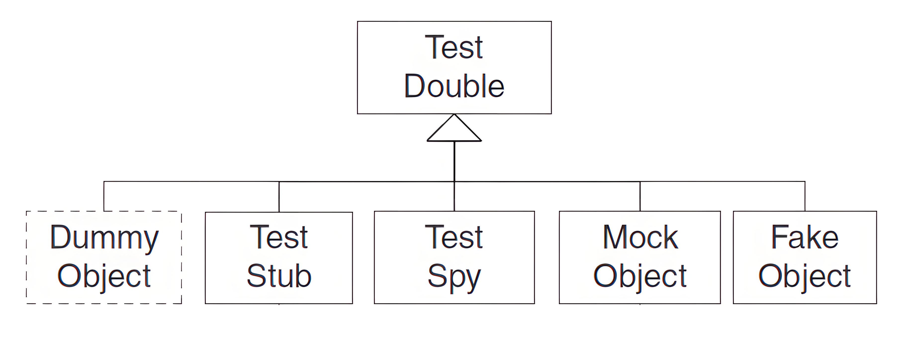

# Four-Phase Test

_Introduzione che mi sembra utile fare, dal link che ha consigliato anche il prof [http://xunitpatterns.com](http://xunitpatterns.com/)_  
Come strutturiamo la nostra logica di test per rendere evidente ciò che stiamo testando?

Ogni test è strutturato in quattro parti distinte eseguite in sequenza. 
È buona pratica progettare ogni test in modo che abbia quattro fasi distinte che
vengono eseguite in sequenza: il set up, l'exercise SUT, la verifica dei risultati e il teardown.

- **SET UP**: prima fase, durante la quale si inizializza tutto il necessario affinché il SUT esibisca il comportamento atteso,
  nonché tutto ciò che è necessario mettere in atto per poter osservare il risultato effettivo
  (ad esempio, creare i vari Test Double).
- **EXERCISE**: seconda fase, durante la quale si interagisce con il SUT.
- **VERIFY**: terza fase, durante la quale si fa tutto il necessario per determinare se il risultato atteso è stato ottenuto o meno
  (asserzioni di vario tipo).
- **TEARDOWN**: quarta fase, fase di pulizia atta a riportare l'ambiente nello stato in cui è stato trovato.




### Why We Do This
Chi legge il test deve essere in grado di determinare rapidamente quale comportamento il test sta verificando. 
Può essere molto confusionario quando vengono invocati diversi metodi del SUT atti a fare cose diverse.
Identificando chiaramente le quattro fasi, è molto più facile capire l'intento del test.

Inoltre, bisogna evitare la tentazione di testare più funzionalità possibili in un unico metodo di test,
perché ciò può portare a test poco leggibili e a una logica di test troppo complessa. Anzi, l'ideale è avere 
molti metodi di test piccoli che testino una singola funzionalità.
L'uso di commenti per contrassegnare le divisione di un test in quattro fasi è una buona fonte di autodisciplina, 
in quanto rende molto evidente quando i nostri test non testano una singola funzionalità (soprattutto le fasi di exercise e verify)

Certo, i test possono funzionare anche se testano più funzionalità, ma forniranno una minore localizzazione delle anomalie 
rispetto a un gruppo di test indipendenti che testano singole funzionalità. 

# Mocking and Test Double

Abbiamo visto, anche a laboratorio, come a volte è semplicemente difficile testare il **system under test** (SUT) 
perché dipende da altri componenti che non possono essere utilizzati durante il testing. Ciò può avvenire perché questi 
non sono disponibili in questo momento, non restituiscono i risultati necessari per il test che vogliamo fare 
(o far in modo che li restituiscano è molto complesso) oppure perché la loro esecuzione avrebbe effetti collaterali 
indesiderati. In altri casi, la nostra strategia di test richiede un maggiore controllo o visibilità del comportamento 
interno del SUT.

Quando si scrive un test in cui non si può (o si sceglie di non) usare il vero componente da cui si è dipendenti 
(**DOC depended-on component**), lo si può sostituire con un Test Double. **Test Double** è un termine generico utilizzato 
per indicare un qualunque oggetto con cui si sostituisce un oggetto reale a scopo di test. Il Test Double non deve 
comportarsi esattamente come il DOC reale: deve solo fornire le stesse API in modo che la sua presenza risulti essere 
trasparente al SUT.  
Ai fini del test, quindi, durante quella che è la fase set up possiamo sostituire il DOC (non il SUT!) con un Test Double. 

A seconda del tipo di test che stiamo eseguendo, possiamo codificare diversamente il comportamento del Test Double. Quando il SUT 
interagisce con il Test Double, non si accorgerà di nulla e ci permetterà di rendere possibili test che sembravano impossibili.

Il **mocking** è quindi la tecnica di testing che ci permette di sostituire i DOC reali con i vari test double: ne risultano test
più efficienti, affidabili e puliti, consentendo agli sviluppatori di isolare il SUT in un ambiente di testing controllato.

Vediamo ora i diversi tipi di Test Double.




### Dummy Object

A volte per poter testare un oggetto (il SUT) è necessario fare in modo che si trovi in un determinato stato.
Per far si che il SUT sia nello stato corretto può essere necessario anche chiamare alcuni suoi metodi.
Questi spesso prendono come argomenti oggetti che vengono memorizzati in variabili d'istanza solo per un uso successivo:
questi oggetti (o almeno alcuni di questi oggetti) non vengono mai utilizzati nel codice che stiamo testando e quindi
ci troviamo a doverli creare solo per conformarci alla firma di qualche metodo che dobbiamo chiamare per portare la SUT
nello stato giusto. La costruzione di questi oggetti può essere non banale e aggiunge una complessità non necessaria al test.

In questi casi, si può passare un Dummy Object come argomento, eliminando la necessità di costruire un oggetto reale:
i **dummy object** sono quindi una forma degenerata di Test Double, esistono solo per poter essere passati da un metodo 
all'altro; non vengono mai utilizzati.

Si noti che un Dummy Object non è la stessa cosa di un Null Object. Un Dummy Object non viene utilizzato dal SUT, 
quindi il suo comportamento è irrilevante. Al contrario, un Null Object viene utilizzato dal SUT ma è progettato 
per non fare nulla. È una distinzione piccola ma molto importante.

<style>
td, tr {
   border: none!important;
}
</style>
<table>
<tbody>
<tr>
<td>Senza Mokito</td>
<td>Con Mokito</td>
</tr>
<tr>
<td>

```java
@Test 
public void testDummy() {
    MyClass dummy = ??;

    List<MyClass> SUT = new ArrayList<MyClass>();
    
    SUT.add(dummy);

    assertThat(SUT.size()).isEqualTo(1);
}
```
</td>
<td>

```java
@Test 
public void testDummy() {
    MyClass dummy = mock(MyClass.class);
    
    List<MyClass> SUT = new ArrayList<MyClass>();
    
    SUT.add(dummy); 
    
    assertThat(SUT.size()).isEqualTo(1);
} 
```
</td>
</tr>
</tbody>
</table>

### Stub Objects

Come detto, a volte risulta, essere difficile testare un SUT perché il suo comportamento dipende da quelli che sono input 
provenienti da altri componenti software (DOC). Per testare quindi il SUT in modo indipendente dobbiamo sostituire
questi oggetti reali con oggetti che siano test-specific: oggetti che immettano gli input indiretti desiderati nel SUT.

Questi oggetti test-specific prendono il nome di **Test Stub**: sostituiscono un componente reale, da cui 
dipende il SUT, e forniscono risposte (input) preconfezionati alle chiamate fatte durante il testing. Ciò consente al 
test di forzare il SUT a seguire determinati percorsi che altrimenti non avrebbe potuto eseguire.

<style>
td, tr {
   border: none!important;
}
</style>
<table>
<tbody>
<tr>
<td>Senza Mokito</td>
<td>Con Mokito</td>
</tr>
<tr>
<td>

```java
@Test
public void testConStub() {
    MyClass stub = ??;
    MyList<int> SUT = new MyList<int>();

    SUT.add(stub.getValue(0));  // deve ritornare 4
    SUT.add(stub.getValue(1));  // deve ritornare 7
    SUT.add(stub.getValue(1));  // deve ritornare 3
    res = SUT.somma();
    assertThat(res).isEqualTo(14);
}
```
</td>
<td>

```java
@Test
public void testConStub() {
    MyClass stub = mock(MyClass.class);
    when(stub.getValue(0)).thenReturn(4);
    when(stub.getValue(1)).thenReturn(7, 3);
    
    MyList<int> SUT = new MyList<int>();
    SUT.add(stub.getValue(0));  // deve ritornare 4
    SUT.add(stub.getValue(1));  // deve ritornare 7
    SUT.add(stub.getValue(1));  // deve ritornare 3
        
    res = SUT.somma();
    
    assertThat(res).isEqualTo(14);
}
```
</td>
</tr>
</tbody>
</table>

### Mock Object

Quando il comportamento del sistema sotto test (SUT) include azioni che non possono essere osservate attraverso la sua
interfaccia, ma che anzi sono osservate da/su altri componenti software, chiamiamo tali azioni
output indiretti del SUT. Gli output indiretti possono essere chiamate di metodi o funzioni a un altro componente,
record inseriti in un database, record scritti su un file o cosi via. La verifica dei comportamenti degli output indiretti del SUT
richiede punti di osservazione appropriati: per implementare il punto di osservazione si utilizzano spesso oggetti Mock,
che intercettano gli output indirette del SUT e permettono di confrontarle con i valori attesi.

Quindi un Mock object è utilizzato per instrumentare e controllare le chiamate fatte dal SUT.
In genere, l'oggetto Mock include anche la funzionalità di uno stub di test, nel senso che deve restituire valori
al SUT, ma l'enfasi è sulla verifica delle chiamate effettuate dal SUT. Pertanto, un Oggetto Mock è diverso da un Test 
Stub o almeno viene usato in modo fondamentalmente diverso.

<style>
td, tr {
   border: none!important;
}
</style>
<table>
<tbody>
<tr>
<td>Senza Mokito</td>
<td>Con Mokito</td>
</tr>
<tr>
<td>

```java
@Test
public void testConMock() {
    MyClass mock = ??;
    
    MyList<int> SUT = new MyList<int>();
    
    res = SUT.somma(mock);
    
    assertThat(res).isEqualTo(14);
    // assert che getValue è stata chiamata 3 volte
    // prima una volta con parametro 0 e poi...
}
```
</td>
<td>

```java
@Test 
public void testConMock() {
     MyClass mock = mock(MyClass.class);
     
     when(mock.getValue(0)).thenReturn(4); 
     when(mock.getValue(1)).thenReturn(7,3);

     MyList<int> SUT = new MyList<int>();

     res = SUT.somma(mock);
     
     assertThat(res).isEqualTo(14); 
     InOrder io = inOrder(mock); 
     io.verify(mock).getValue(0); 
     io.verify(mock, times(2)).getValue(1);
} 
```
</td>
</tr>
</tbody>
</table>

## Spy objects

Un altro modo per implementare punti di osservazione che controllino e instrumentino le chiamate effettuate dal SUT
su determinati DOC sono gli Spy object: a differenza dei mock questi sono costruiti a partire da oggetti reali.

Successivamente alla fase d'interazione con il SUT (exercise), durante la fase di verifica dei risultati (verify), il test 
confronta le chiamate effettuate dal SUT sul Test Spy con il comportamento desiderato (expected).

<style>
td, tr {
   border: none!important;
}
</style>
<table>
<tbody>
<tr>
<td>Senza Mokito</td>
<td>Con Mokito</td>
</tr>
<tr>
<td>

```java
@Test
public void testConSpy() {
        MyClass spy = ??;

        MyList<int> SUT = new MyList<int>();

        res = SUT.somma(spy);

        assertThat(set).isEqualTo(14);
        //assert che getValue è stata chiamata 3 volte
        //prima una volta con parametro 0 e poi...    
        }
```
</td>
<td>

```java
@Test 
public void testConSpy() {
     MyClass spy = spy(new MyClass());

     MyList<int> SUT = new MyList<int>();

     res = SUT.somma(spy);
     
     assertThat(res).isEqualTo(14); 
     InOrder io = inOrder(spy); 
     io.verify(spy).getValue(0); 
     io.verify(spy, times(2)).getValue(1);
} 
```
</td>
</tr>
</tbody>
</table>


### Fake Object

Oggetti che implementano davvero le funzionalità del DOC ma usando una qualche scorciatoia, dunque in maniera non 
realistica o non installabile: database in memoria invece di database reale, soluzioni inefficienti, parti di codice 
open source utilizzabili nella fase di testing ma non in quella di produzione, ecc... .


## Mokito

Mockito è un framework di testing open source per Java rilasciato sotto la licenza MIT. 
Il framework facilita di gran lunga la creazione di oggetti test double permettendo quindi di concentrarsi maggiormente
nella scrittura della logica di testing, senza preoccuparsi di creare ambienti di testing complessi.  
Inoltre creando i test double con mockito e utilizzando poi l'insieme di metodi che ci fornisce permette di rendere i nostri
test estremamente più leggibili.

Mockito mette a disposizione principalmente due metodi per creare oggetti test double: il metodo `mock()` e il metodo `spy()`.

Il metodo `mock()` è usato per creare oggetti **test double** (dummy, stub o mock objects) a partire da una determinata 
classe o interfaccia: l'oggetto creato si presenterà con la stessa interfaccia (_metodi e firme di questi_) del tipo specificato
in fase di costruzione. Di default per ogni metodo dell'oggetto reale il test double creato fornisce **un'implementazione minimale**:
restituirà i valori di default per il tipo di ritorno di tale metodo, se void non farà nulla.  
Ad esempio, se si crea un oggetto con `mock()` a partire da una classe che ha un metodo `getValue()` 
che restituisce un `int`, il metodo `getValue()` del test double ogni volta che verrà chiamato restituirà 0, 
che è il valore predefinito per un `int` in Java.  
Il test double può essere configurato, mediante opportuna operazione di _stubbing_, 
anche per restituire valori specifici o lanciare eccezioni quando vengono chiamati determinati metodi.

Il metodo `spy()` viene utilizzato per creare spy objects a partire da oggetti reali. Quello che si ottiene è un oggetto che 
ha le stesse funzionalità dell'oggetto originale, ma che può essere utilizzato per fare il "tracciamento" delle chiamate ai suoi metodi e 
per verificare che vengano eseguite come previsto. A differenza degli oggetti creati con il metodo `mock()`, una spia 
continuerà a chiamare il metodo reale, a meno che non si specifica il contrario con un'operazione di _stubbing_.

#### Stubbing

```java
when(mockedObj.methodname(args)).thenXXX(values);
```
- args: values | matchers | argumentCaptor
- matchers: anyInt() | argThat(is(closeTo(1.0, 0.001)))
- thenXXX: thenReturn | thenThrows | thenAnswer | thenCallRealMethod

Il metodo `when()` insieme ai vari `thenXXX()` (es `thenReturn()`, `thenThrow()`) è usato per specificare 
il comportamento di un test double (stub mock o spy obj) quando viene chiamato un suo determinato metodo.
Supponiamo di avere una classe _Foo_ con un metodo `getValue()` che restituisce un `int`, allora per specificare il comportamento di
questo in modo tale che restituisca un valore diverso dallo 0 (default per int), possiamo scrivere:
```java
Foo foo = mock(Foo.class);
when(foo.getValue()).thenReturn(42);
```
Ora d'ora in poi il metodo `getValue()` del test double restituirà l'intero 42 ogni volta che verrà chiamato.  
Ovviamente il metodo `when()` può essere usato per specificare il comportamento di qualsiasi metodo del test double.
Se quindi scriviamo qualcosa del genere:
```java
Foo foo = mock(Foo.class);
when(foo.someMethod()).thenThrow(new SomeException());
```
il test double lancerà un'eccezione di tipo `SomeException` quando viene chiamato il suo metodo `someMethod()`. 
Questo ci permette per esempio di testare il comportamento del nostro codice quando viene lanciata un'eccezione senza dover 
implementare l'oggetto reale.


Anche i metodi del tipo `doXXX()` (es. `doReturn()`, `doThrow()`, `doAnswer()`, `doNothing()`) sono usati per 
specificare il comportamento del test double quando viene chiamato un suo metodo. Tuttavia a differenza del metodo
`when()`, questi possono essere usati anche per specificare il comportamento di un metodo che ha come tipo di ritorno void. Anzi,
il prof consiglia di usarli solo in questo caso, oppure in tutti i casi in cui utilizzare il metodo `when()` risulta difficile
(metodi con tipi di ritorno non banali come `Optional`).
Questi metodi si utilizzano come segue:
  ```java
  doXXX(values).when(mockedObj).methodname(args)
  ```

#### Verifying

Con oggetti di tipo mock o spy spesso vogliamo verificare l'occorrenza di una chiamata con certi parametri. 
Mockito ci permette di farlo con il metodo `verify()`: possiamo sia verificare che un metodo sia stato chiamato, 
con quali parametri è stato chiamato e anche il numero di volte che è stato chiamato.
```java
verify(mockedclass, howmany).methodname(args)
```
Il parametro _howMany_ del metodo verify specifica il numero di volte che il metodo associato all'oggetto mockato deve essere 
chiamato durante l'esecuzione del test. Le possibili opzioni sono:

-   `times(n)`: verifica che `methodname()` sia stato chiamato esattamente `n` volte.
-   `never()`: verifica che `methodname()` non sia mai stato chiamato.
-   `atLeastOnce()`: verifica che `methodname()` sia stato chiamato almeno una volta.
-   `atLeast(n)`: verifica che `methodname()` sia stato chiamato almeno `n` volte.
-   `atMost(n)`: verifica che `methodname()` sia stato chiamato al massimo `n` volte.

Se si desidera verificare l'ordine delle occorrenze delle chiamate ai metodi di un oggetto, si può utilizzare 
il metodo `inOrder()`:
```java
InOrder inO = inOrder(mock1, mock2, ...)
inO.verify...
```

È possibile anche catturare un parametro per farci sopra asserzioni
```java
ArgumentCaptor<Person> arg = ArgumentCaptor.forClass(Person.class);
verify(mock).doSomething(arg.capture());
assertEquals("John", arg.getValue().getName());
```

#### Argument Matchers

Quando si esegue un'operazione di stubbing oppure quando si verifica la chiamata a un metodo al posto di specificare i valori
precisi (values) si può utilizzare quello che è un **argument matcher**. Questo agisce come un segnaposto che corrisponde
a qualsiasi valore corretto, che soddisfa la condizione di match, consentendo di specificare il comportamento senza
dover conoscere il valore esatto dell'argomento che sarà passato al metodo. Possibili matcher sono i seguenti:

* `any()`, `anyInt()`, `anyString()`, etc.: These methods are used to create argument matchers, which allow you to specify
  that a particular method argument can be any value of a particular type. For example, you can use `anyInt()` to specify
  that an argument can be any int value. This is useful when you want to stub a method to return a value regardless of
  the arguments that are passed to the method.

* `eq()`: This method is used to create an argument matcher that matches a specific value. For example, you can use `eq(42)`
  to specify that an argument must be the value 42 in order to match. This is useful when you want to stub a method to
  return a value only when it is called with specific arguments.

* The `argThat()` method is a more general way to specify an argument matcher. It allows you to create a custom argument
  matcher by implementing the ArgumentMatcher interface, which defines a `matches()` method that you can use to determine
  whether a particular argument matches the matcher. This is useful when you want to match arguments in a more complex or
  flexible way than the built-in argument matchers provided by Mockito.

* The `is()` method, on the other hand, is a shortcut for creating common types of argument matchers. It allows you to
  create argument matchers for specific types of arguments, such as null, `any()`, or `eq()`. For example, you can use `is(null)`
  to specify that an argument must be null in order to match, or `is(anyInt())` to specify that an argument must be any int
  value in order to match. This is a convenient way to specify argument matchers for common cases, without having to create
  a custom `ArgumentMatcher` class.

  
Infine il metodo `reset()` è usato per ripristinare un test double al suo stato iniziale, cancellando qualsiasi metodo 
che era stato precedentemente ridefinito. È utile quando si vuole riutilizzare un test double in più test.


### Esempio di testing con pattern <big>O</big>BSERVER (PULL)

```java
@Test
void modelTest {
    // setup
    Model model = new Model();
    Observer obs = mock(Observer.class);
    Observer obs1 = mock(Observer.class);

    // exercise
    model.addObserver(obs);
    model.addObserver(obs1);
    model.setTemp(42.0, scale);

    // verify
    verify(obs).update(eq(model), eq("42.0"));
    verify(obs1).update(eq(model), eq("42.0"));
}
```

Test di un observer con un modello non generico ma di cui ho solo interfaccia di cui fornisco una versione dummy:

```java
@Test
void observerTest {
    abstract class MockObservableIModel extends Observable implements Model {};
    MockOBservableIModel model = mock(MockObservableIModel.class);
    when(model.getTemp()).thenReturn(42.42);

    observer.update(model, null);

    verify(model).getTemp();
    assertThat(val).isCloseTo(42.42, Offset.offset(.01));
}
```