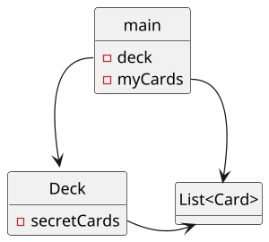

# Conoscenze preliminari

Prima di proseguire è bene richiamare concetti e termini fondamentali presumibilmente visti durante il corso di Programmazione II.

## Object orientation

Per essere definito _object oriented_, un linguaggio di programmazione deve soddisfare tre proprietà:
- __Ereditarietà__: ovvero la possibilità di poter definire una classe ereditando proprietà e comportamenti di un'altra classe.
- __Polimorfismo__: quando una classe può assumere diverse forme in base alle interfacce che implementa. 
Il prof fa l'esempio del _tennista scacchista_: in un torneo di tennis è poco utile sostituire una persona che gioca a tennis ed è brava con gli scacchi (quindi una classe che implementa entrambe le interfacce) con una che gioca sia a tennis che a scacchi, basta che sappia giocare tennis.
Il collegamento tra capacità e oggetto è fatto __a tempo di compilazione__: non è importante quindi se la capacità non è ancora definita;
- __Collegamento dinamico__: in Java il tipo concreto degli oggetti può non essere specificato staticamente e quindi il problema di stabilire _quale metodo chiamare_ viene risolto durante l'esecuzione. 
In C++ occorre esplicitare questo comportamento utilizzando la keyword `virtual`.

## <a style="color: darkgreen">SOLID</a> principles

Ci sono 5 parti che compongono questo principio:
1. __<span style="color: darkgreen"><big>S</big></span>INGLE RESPONSIBILITY__: una classe, un solo scopo.
Così facendo, le classi rimangono semplici e si agevola la riusabilità.
2. __<span style="color: darkgreen"><big>O</big></span>PEN-CLOSE PRINCIPLE__:
le classi devono essere aperte ai cambiamenti (_opened_) ma senza modificare le parti già consegnate e in produzione (_closed_).
Il refactoring è comunque possibile, ma deve essere preferibile estendere la classe attuale.
3. __<span style="color: darkgreen"><big>L</big></span>ISKOV SUBSTITUTION PRINCIPLE__:
c'è la garanzia che le caratteristiche eredidate dalla classe padre continuinino ad esistere nelle classi figlie.
Questo concetto si collega all'aspetto __contract-based__ del metodo Agile: le _precondizioni_ di un metodo di una classe figlia devono essere ugualmente o meno restrittive del metodo della classe padre.
Al contrario, le _postcondizioni_ di un metodo della classe figlia non possono garantire più di quello che garantiva il metodo nella classe padre.
Fare _casting_ bypassa queste regole.
4. __<span style="color: darkgreen"><big>I</big></span>NTERFACE SEGREGATION__:
più le capacità e competenze di una classe sono frammentate in tante interfacce più è facile utilizzarla in contesti differenti.
In questo modo un client non dipende da metodi che non usa. 
Meglio quindi avere __tante interfacce specifiche__ e piccole (composte da pochi metodi), piuttosto che poche, grandi e generali. 
5. __<span style="color: darkgreen"><big>D</big></span>EPENDENCY INVERSION__:
il codice dal quale una classe dipende non deve essere più __concreto__ di tale classe.
Per esempio, se il _telaio della FIAT 500_ dipende da uno specifico motore, è possibile utilizzarlo solo per quel specifico motore.
Se invece il telaio dipende da _un_ concetto di motore, non c'è questa limitazione.
In conclusione, le classi concrete devono tendenzialmente dipendere da classi astratte e non da altre classi concrete.

## Reference escaping

Il _reference escaping_ è una violazione dell'incapsulamento (_compiere questo errore equivale ad una bocciatura diretta all'esame_).



Basandoci sull'esempio del mazzo di carte, vogliamo che la sua implementazione rimanga __segreta__, quindi ecco i possibili _errori_ per non rispettare questa condizione:

- quando un getter ritorna un riferimento a un segreto;
```java
public Deck {
    private List<Card> cards;
        
    public List<Card> getCards() {
        return this.cards;
    }
}
```
- quando un setter assegna a un segreto un riferimento che gli viene passato;
```java
public Deck {
    private List<Card> cards;

    public setCards(List<Card> cards) {
        this.cards = cards;
    }
}
```

- quando il costruttore assegna al segreto un riferimento che gli viene passato;
```java
public Deck {
    private List<Card> cards;

    public Deck(List<Card> cards) {
        this.cards = cards;
    }
}
```

## Encapsulation e information hiding

__Legge di Parnas (L8)__.
> _Solo ciò che è nascosto può essere cambiato liberamente e senza pericoli._

Lo stato mostrato all'esterno non può essere modificato, mentre quello nascosto sì.

Questo principio serve per __facilitare la comprensione del codice__ e renderne più facile la modifica parziale senza fare danni. Dovrà essere quindi chiarito prima dell'implementazione ciò che sarà pubblico e ciò che invece sarà privato.

## Legacy o Deprecated

Una classe o una funzionalità, dopo diverse modifiche nel tempo, può arrivare un punto di non ritorno, dove l'evoluzione si ferma per diversi motivi, come un design iniziale troppo limitante o l'arrivo di un innovazione tecnologica. 

In questi casi la funzione può essere chiamata:

- __Legacy__: Una classe di questo genere continuerà a funzionare e sarà supportata, però verrà consigliato l'utilizzo di un altra classe più recente.
- __Deprecated__: In questo caso la classe resterà comunque funzionante ma non sarà più supportata. Il suo utilizzo sarà fortemente sconsigliato e si spingerà il programmatore a fare un refactoring del codice laddove è presente la funzione deprecata.
Essa deve essere sostituita con la nuova classe standard, poichè dopo un certo lasso di tempo verrà rimossa o la sua funzionalità non sarà più garantita.

## Immutabilità

Una classe è immutabile quando non c'è modo di modificare lo stato di ogni suo oggetto dopo la creazione. 
Questo ci garantisce grandi vantaggi, come ad esempio condividere oggetti senza il rischio che il suo stato venga modificato (in questo modo l'encapsulation potrebbe non essere rispettata), quindi sarà fondamentale _massimizzare_ l'utilizzo di questo tipo di classi.

Per assicurare tale proprietà è necessario:
- __non fornire metodi di modifica__ allo stato;
- avere tutti gli __attributi privati__ per i tipi potenzialmente mutabili (come `List<T>`) e fornire solo il valore tramite i _getter_ e non la referenza;
- avere tutti gli __attributi final__ se non già privati;
- assicurare l'__accesso esclusivo__ a tutte le parti non mutabili, ovvero non avere reference escaping.

## Code smell

I _code smell_ sono dei segnali, che suggeriscono problemi nella progettazione del codice, mantenere questi problemi nel codice significa aumentare il debito tecnico. 
Di seguito ne sono elencati alcuni:
- __codice duplicato__: si può fare per arrivare velocemente al verde quando si usa la tecnica TDD, ma è da rimuovere con il refactoring. Rischia di portarsi dietro degli errori o particolarità legate al applicazione originale di questo codice. È dunque importante cercare di fattorizzare il più possibile.
- __metodi troppo lunghi__: non è un vincolo "_hard_" dato che dipende dai casi ma  solitamente sono poco leggibili e poco riusabili;
- __troppi livelli di indentazione__: scarsa leggibilità e riusabilità, è bene fattorizzare il codice invece che avere una serie di if e for _innestati_ che lo rendono confusionario, quindi è meglio creare dei metodi con nomi chiari per evitare ciò.
- __troppi attributi__: suggerisce che la classe non rispetta la single responsability, ovvero fa troppe cose;
- __lunghe sequenze di _if-else_ o _switch___: possono essere sostituiti da strutture basate su polimorfismo e collegamento dinamico;
- __classe troppo grande__;
- __lista parametri troppo lunga__: se proprio ne ho bisogno meglio raggrupparli in una struttura e passarli come unico parametro;
- __numeri magici__: è importante assegnare alle costanti numeriche all'interno del codice un nome per comprendere meglio il loro scopo, infatti dei semplici numeri possono avere significati diversi in base al loro contesto, ad esempio uno zero può indicare il suo valore numerico, l'assenza di valori o NULL;
- __commenti che spiegano cosa fa il codice__: indica/ammette che il codice non è abbastanza chiaro;
- __nomi oscuri o inconsistenti__;
- __codice morto__: nel programma non deve essere presente del codice irraggiungibile, commentato o non testato. 
Questo appesantisce il progetto o porta a possibili rischi, è quindi preferibile eliminarlo.
Nel caso in cui dovesse tornare utile è possibile recuperarlo utilizzando strumenti di versioning, accedendo a commit precedenti alla sua cancellazione.
- __getter e setter__: Questi metodi causano la perdita dell'incapsulation e dell'information hiding, perchè esportano esternamente il segreto contenuto nella classe. 
Sono utili nella fase preliminare della stesura del codice, è importante rimuoverli per far spazio a dei metodi che permettano all'utente di eseguire una specifica operazione da lui richiesta, piuttosto che fornirgli il dato e permettergli di elaborarlo come meglio crede (vedi principio di [__tell don't ask__](./04_tell-dont-ask.md) nella prossima sezione).

Ecco alucni link utili per approfondire i code smell:
- [Refactoring guru](https://refactoring.guru/refactoring/smells)
- [Wikipedia](https://en.wikipedia.org/wiki/Code_smell)
- [Luzkan](https://luzkan.github.io/smells/)
