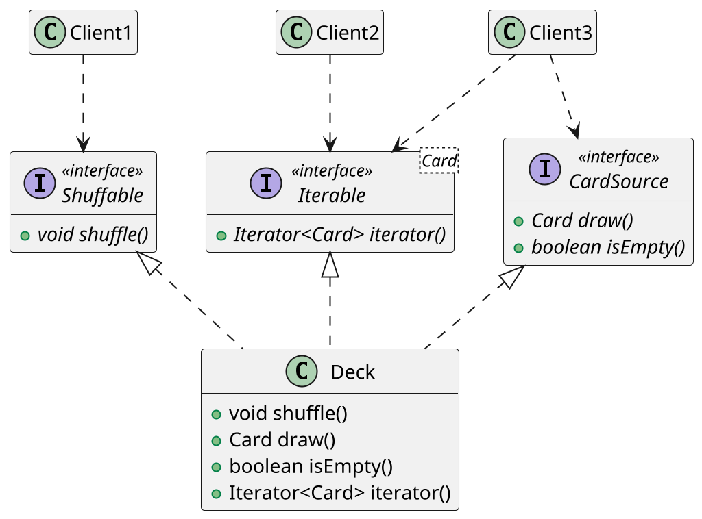

# Interfacce multiple

Tornando all'esempio, la classe `Deck` (che implementa `CardSource`) __può implementare anche altre interfacce__, come `Shuffable` o `Iterable<Card>`. 
Al metodo precedente interessa solo che Deck abbia le capacità specificate in `CardSource`, se poi implementa anche altre interfaccie è ininfluente.

