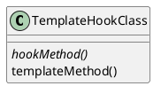
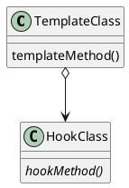
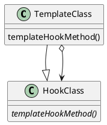

# Discutere di pattern: i meta-patterns

Prima di iniziare a parlare dei principali pattern che un informatico dovrebbe conoscere, possiamo chiederci come possiamo parlare di pattern: semplice, con dei [_meta-patterns_](https://web.archive.org/web/20170809131649/http://www.info.uni-karlsruhe.de/~i44www/lehre/swk/2003SS/Papiere/ECOOP1994-Pree-Metapatterns.pdf), pattern con cui costruire altri pattern!

Nello specifico, i meta-patterns identificano due elementi base su cui ragionare quando si trattano i pattern:

- __HookMethod__: un "metodo astratto" che, implementato, determina il comportamento specifico nelle sottoclassi; è il _punto caldo_ su cui interveniamo per adattare lo schema alla situazione.

- __TemplateMethod__: consiste in una struttura generale che contiene delle parti cambiabili, ovvero gli hook.
Quindi è metodo che coordina generalmente più HookMethod per realizzare il design voluto; è l'_elemento freddo_ di invariabilità del pattern che ne realizza la rigida struttura.

Un esempio potrebbe essere una funzione di ordinamento, dove c'è uno scheletro generale dell'algoritmo (template) al cui interno non viene specificato il modo in cui avviene la comparazione tra elementi.
Customizzando questa comparazione si realizzano gli hook, che se inseriti all'interno del templete rendono l'algoritmo funzionante.

Ovviamente i metodi _template_ devono avere un modo per accedere ai metodi _hook_ se intendono utilizzarli per realizzare i pattern.
Tale collegamento può essere fatto in tre modi differenti:

- __Unification__: _hook_ e _template_ si trovano nella stessa classe astratta, classe da cui erediteranno le classi concrete per implementare i metodi _hook_ e, di conseguenza, il pattern; i metodi _template_ sono invece già implementati in quanto la loro struttura non si deve adattare alla specifica applicazione.
Un esempio è presente nell'interfaccia Iterable, che richiede l'implementazione dei metodi next e hasNext, inoltre è presente anche un metodo di default chiamato forEach che permette di chiamare next fintantochè hasNext restituisce true.
Tutti questi metodi si trovano nella stessa interfaccia; la struttura generale che vale sempre è data dal metodo di default forEach, e gli hook invece sono next e hasNext, che se forniti permettono a forEach di funzionare. 

- __Connection__: _hook_ e _template_ sono in classi separate, indicate rispettivamente come _hook class_ (astratta) e _template class_ (concreta, che rimane), collegate tra di loro da un'aggregazione: la classe template contiene cioè un'istanza della classe hook, in realtà un'istanza della classe concreta che realizza i metodi hook usati per implementare il pattern (in base all'implementazione dell'hook utilizzata il comportamento generale cambia).

- __Recursive connection__: come nel caso precedente _hook_ e _template_ sono in classi separate, ma oltre all'aggregazione tali classi sono qui legate anche da una relazione di generalizzazione: la classe template è una hook class (questo tipo di relazione viene adottato dai pattern decorator e composit).
Le relazioni tra le due classi sono doppie e magari ricorsive.

Vedremo a quale meta-pattern aderiranno i pattern che vediamo. 
A tal proposito,i pattern che vedremo fanno parte dei cosiddetti "__Gang Of Four patterns__", una serie di 23 pattern definiti da Erich Gamma, Richard Helm, Ralph Johnson e John Vlissides, ormai molti anni fa ma ancora attuali. Oltre ad averli definiti li hanno divisi in tre categorie:

- __Creazionali__: legati alla creazione di oggetti
- __Comportamentali__: legati all'interazione tra oggetti
- __Strutturali__: legati alla composizioni di classi e oggetti
