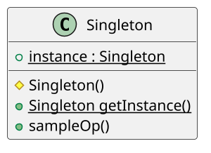

# <big>S</big>INGLETON

Talvolta vorremmo che di un certo oggetto esistesse __una sola istanza__ perché logicamente di tale oggetto non ha senso esistano diverse copie all'interno dell'applicazione (es. diverse istanze della classe Gioco in un sistema che gestisce un solo gioco alla volta).
Tuttavia i linguaggi Object-Oriented forniscono solo classi che poi possono essere istanziate senza limiti, per cui la realizzazione di questa unicità può rivelarsi più complessa del previsto.

La soluzione consiste nel rendere la classe stessa responsabile del fatto che non può esistere più di una sua istanza: per fare ciò il primo passo è ovviamente quello di _rendere privato il costruttore_, o se non privato comunque non pubblico (conviene metterlo protected in modo da poter creare sottotipi). \
Bisogna però garantire comunque un modo per recuperare l'unica istanza disponibile della classe: si crea dunque il _metodo statico_ `getInstance` che restituisce a chi lo chiama l'unica istanza della classe, creandola tramite il costruttore privato se questa non è già presente.
Tale istanza è infatti memorizzata in un _attributo statico_ della classe stessa, in modo così da poterla restituire a chiunque ne abbia bisogno.

La creazione dell'istanza avviene solo alla prima chiamata del metodo statico che restituisce l'istanza per evitare di _appesantire_ inutilmente il carico di lavoro sulla macchina virtuale. Se per caso questa instanza ci servirà solo per un breve momento in un momento avanzato del processo, non ha senso appesantire il _boot_ della macchina istanziando qualcosa di cui non necessito.



Con queste accortezze è possibile creare una classe Singleton simile a questa:

```java
public class Singleton {
    /* costruttore privato o comunque non pubblico */
    protected Singleton() { ... }

    /* salvo l'istanza per usarla dopo */
    private static Singleton instance = null;

    /* metodo statico */
    public static Singleton getInstance() {
        if (instance == null) {
            instance = new Singleton();
        }
        return instance;
    }

    public void metodoIstanza() { ... }
}
```

Tuttavia, per come lo abbiamo scritto questa classe non assicura di non creare più di un'istanza di sé stessa, in quanto non prende in considerazione la __concorrenza__.
Se due processi accedono in modo concorrente al metodo `getInstance`, per problemi di scheduling, entrambi potrebbero eseguire il controllo sul valore nullo dell'istanza nello stesso momento o prima che l'altro processo l'abbia effettivamente istanziato e quindi rischiare di crearne più di una o restituire NULL poichè non ancora istanziata effettivente! Questa cosa distrugge completamente il nostro pattern!

Una prima soluzione sarebbe di mettere un lock sull'esecuzione del metodo anteponendovi la direttiva `@Synchronized`: tuttavia, tale approccio comporterebbe un notevole calo di prestazioni dato che verrà usata ogni volta che chiametero il metodo e non solo prima della prima chiamata, che è la nostra sezione critica del codice. \
Una soluzione molto più efficiente è invece quella che prevede di avere un _blocco sincronizzato_ di istruzioni posto all'interno del ramo in cui si pensa che l'istanza sia nulla in cui ci si chiede se effettivamente l'istanza è nulla e solo allora si esegue il costruttore; la presenza del doppio controllo assicura che non vi siano squilibri dovuti alla concorrenza, mentre sincronizzare solamente un blocco e non l'intero metodo fa sì che il calo di prestazioni sia sentito solamente durante le prime chiamate concorrenti, infatti una volta creata il singleton non si entrerà più in quel blocco, indipendentemente dallo scheduling del processo. \
Questa soluzione non era applicabile prima di Java 5 poichè al tempo l'allocazione della memoria di un oggetto e l'effettiva creazione dell'istanza erano gestite separatamente e quindi c'era il rischio di avere solo allocato la memoria ma non averci scritto nulla, quindi avremmo restituito una referenza vuota.

## Idioma Java

La presentazione appena vista è corretta concettualmente ma come abbiamo detto ogni linguaggio grazie alle sue caratteristiche particolare può sviluppare degli __idiomi__ un po' diversi ma che applicano lo stesso concetto. Nel caso di Java il Singleton invece che usare una classe per definire l'oggetto si usa un __enumerativo__ con un unico valore, l'_istanza_.
Ciascun valore di tali oggetti è infatti trattato nativamente da Java proprio come un Singleton: viene creato al momento del suo primo uso, non ne esiste più di una copia, e chiunque vi acceda accede sempre alla medesima istanza.
La possibilità di creare attributi e metodi all'interno degli `enum` completa il quadro.

```java
public enum MySingleton {
    INSTANCE;

    public void metodoIstanza() { ... }
}

MySingleton.INSTANCE.sampleOp();
```

Si tratta inoltre di un approccio "thread safe", ovvero che lavora già bene con la concorrenza; l'unico svantaggio è che, se non si conosce l'idioma, a prima vista questa soluzione risulta molto meno chiara rispetto all'approccio precedente.

Il Singleton per quanto sia un patter interessante non deve essere usato impropriamente visto che va contro alcuni dei principi SOLID e può essere sostituito da altri elementi in base alla circostanza, come le variabili globali, più informazioni a riguardo qui: https://www.davidtanzer.net/david%27s%20blog/2016/03/14/6-reasons-why-you-should-avoid-singletons.html