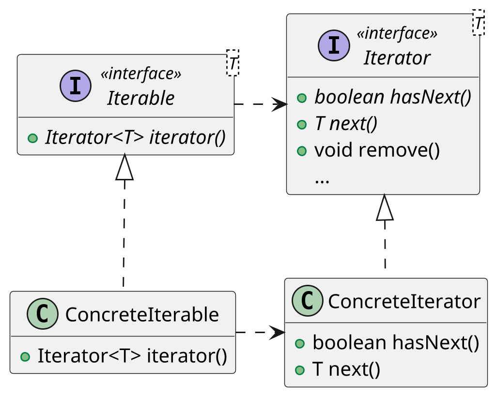

# <big>I</big>TERATOR

Talvolta gli oggetti che definiamo fanno da __aggregatori__ di altri oggetti, contenendo cioè una collezione di questi su cui poi fare particolari operazioni: in questi casi è molto probabile che vorremo poter iterare sui singoli elementi aggregati, ma senza esporre la rappresentazione interna usata per contenerli.
Esistono però altri casi in cui non si ha un aggregatore di oggetti ma è necessario che avvenga un'iterazione, questo è il caso della classe _Scanner_ di java (implementa l'interfaccia Iterator), che permette di gestire un flusso di elementi, tokenizzandolo, e fornisce gli elementi da scansionare uno dopo l'altro fintantochè sono ancora presenti.

Proprio per risolvere questo tipo di problematiche nasce il pattern Iterator: esso consiste nella creazione di una classe `ConcreteIterator` che abbia accesso alla rappresentazione interna del nostro oggetto e esponga i suoi elementi in modo sequenziale tramite i metodi `next()` e `hasNext()`; dovendo accedere alla rappresentazione, molto spesso tale iteratore si realizza come una _classe interna anonima_.

Java supporta largamente il pattern Iterator, a tal punto che nella libreria standard esiste un'interfaccia generica per gli iteratori, `Iterator<E>`: all'interno di tale interfaccia sono definiti, oltre ai metodi di cui sopra, il metodo `remove()`, normalmente non supportato in quanto permetterebbe di modificare la collezione contenuta dalla classe, e il metodo `forEachRemaining()`, che esegue una data azione su tutti gli elementi ancora non estratti dell'iteratore.

Per questioni di chiarezza e semplicità sarebbe meglio non incluedere il metodo _remove()_ nell'interfaccia dell'iteratore poichè non ogni iteratore necessita di tale metodo, questo approccio va a violare il primo principio SOLID, ovvero il __Single responsability__.
Sarebbe il caso di avere due interfacce differenti, una che estende l'altra, oppure due interfaccie distine chiamate ad esempio `Removable<E>` che rende una classe in grado di rimuovere degli elementi, e l'altra `Iterator<E>`, quella appena descritta.
Nel caso in cui una classe implementi entrambe le interfaccie sarà possibile avere un oggetto iterabile ma che allo stesso tempo fornisca la possibilità di rimuovere un elemento, ma sfortunatamente questo non accade in Java.

```java
public interface Iterator<E> {
    boolean hasNext();
    E next();

    default void remove() {
        throw new UnsupportedOperationException("remove");
    }

    /* aggiunta funzionale opzionale */
    default void forEachRemaining(Consumer<? super E> action) {
        Objects.requireNonNull(action);
        while (hasNext())
            action.accept(next());
    }
}
```

Esiste inoltre un'interfaccia che la classe può implementare, questa interfaccia è chiamata `Iterable<E>`: essa richiede solamente la presenza di un metodo `iterator()` che restituisca l'iteratore concreto, e una volta implementata permette di utilizzare il proprio oggetto aggregatore all'interno di un costrutto foreach.



Così, per esempio, possiamo passare dal seguente codice:

```java
Iterator<Card> cardIterator = deck.getCards();
while (cardIterator.hasNext()) {
    Card card = cardIterator.next();
    System.out.println(card.getSuit());
}
```

... a quest'altro:

```java
for (Card card : deck) {
    System.out.println(card.getSuit());
}
```

Oltre ad essere più stringato il codice è significativamente più chiaro, rendendo palese che la singola `card` sia read-only.

Un'osservazione interessante da fare riguardo ad una classe che implementa `Iterable<E>` è che la classe non può essere iterabile su due cose differenti.
Questo perchè i tipi generici sono considerati a tempo di compilazione, ma successivamente per il meccanismo di erasure spariscono, quindi nel codice finale i due tipi generici si sovrappongono e di conseguenza non possono essere distinti, percui non è possibile rendere una classe iterabile rispetto a cose differenti.
