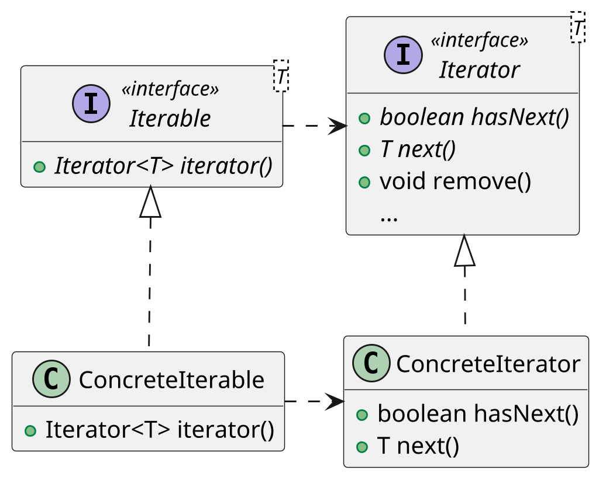

# <big>I</big>TERATOR

Talvolta gli oggetti che definiamo fanno da __aggregatori__ di altri oggetti, contenendo cioè una collezione di questi su cui poi fare particolari operazioni: in questi casi è molto probabile che vorremo poter iterare sui singoli elementi aggregati, ma senza esporre la rappresentazione interna usata per contenerli.

Proprio per risolvere questo tipo di problematiche nasce il pattern Iterator: esso consiste nella creazione di una classe `ConcreteIterator` che abbia accesso alla rappresentazione interna del nostro oggetto e esponga i suoi elementi in modo sequenziale tramite i metodi `next()` e `hasNext()`; dovendo accedere alla rappresentazione, molto spesso tale iteratore si realizza come una _classe interna anonima_.

Java supporta largamente il pattern Iterator, a tal punto che nella libreria standard esiste un'interfaccia generica per gli iteratori, `Iterator<E>`: all'interno di tale interfaccia sono definiti, oltre ai metodi di cui sopra, il metodo `remove()`, normalmente non supportato in quanto permetterebbe di modificare la collezione contenuta dalla classe, e il metodo `forEachRemaining()`, che esegue una data azione su tutti gli elementi ancora non estratti dell'iteratore.

Per questioni di chiarezza e semplicità sarebbe meglio non incluedere il metodo _remove()_ nell'interfaccia dell'iteratore poichè non ogni iteratore necessita di tale metodo, potremmo volerne uno immutabile. Sarebbe il caso di avere due interfacce diverse, magari una figlia dell'altra o addirittura un interfaccia `Removable<E>` che accoppiata ad `Iterator<E>` permette sia di iterare che di eliminare un elemento, ma sfortunatamente questo non accade in Java.

```java
public interface Iterator<E> {
    boolean hasNext();
    E next();

    default void remove() {
        throw new UnsupportedOperationException("remove");
    }

    /* aggiunta funzionale opzionale */
    default void forEachRemaining(Consumer<? super E> action) {
        Objects.requireNonNull(action);
        while (hasNext())
            action.accept(next());
    }
}
```

Esiste inoltre un'interfaccia che l'oggetto iterabile può implementare, `Iterable<E>`: essa richiede solamente la presenza di un metodo `iterator()` che restituisca l'iteratore concreto, e una volta implementata permette di utilizzare il proprio oggetto aggregatore all'interno di un costrutto foreach.



Così, per esempio, possiamo passare dal seguente codice:

```java
Iterator<Card> cardIterator = deck.getCards();
while (cardIterator.hasNext()) {
    Card card = cardIterator.next();
    System.out.println(card.getSuit());
}
```

... a quest'altro:

```java
for (Card card : deck) {
    System.out.println(card.getSuit());
}
```

Oltre ad essere più stringato il codice è significativamente più chiaro, rendendo palese che la singola `card` sia read-only.
