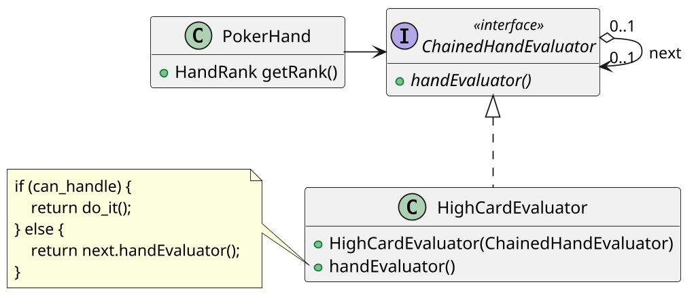

# <big>C</big>HAIN OF <big>R</big>ESPONSIBILITY

Talvolta nei nostri programmi vorremmo definire una gestione "a cascata" di una certa richiesta. Pensiamo per esempio a una serie di regole anti-spam: all'arrivo di una mail la prima regola la esamina e si chiede se sia applicabile o meno; in caso affermativo contrassegna la mail come spam, altrimenti _la passa alla prossima regola_, che a sua volta farà lo stesso test passando il controllo alla terza in caso negativo, e così via.
Abbiamo cioè un _client_ in grado di fare una richiesta, e una __catena di potenziali gestori__ di cui non sappiamo a priori chi sarà in grado di gestirla effettivamente.

Il pattern Chain of Responsibility risolve il disaccoppiamento tra client e gestore _concatenando i gestori_.
Esso prescrive la creazione di un'interfaccia a cui tutti i gestori devono aderire, contenente solo la dichiarazione di un metodo `evaluate` che implementa la logica descritta prima: si stabilisce se si può gestire la richiesta, e se non si può si chiama lo stesso metodo su _un altro gestore_ ottenuto come parametro al momento della creazione.



In questo modo all'interno del client è sufficiente creare una vera e propria catena di gestori e chiamare il metodo `evaluate` del primo: si noti che l'ordine in cui vengono assemblati tali gestori conta, in quanto la valutazione procede sequenzialmente.

```java
public interface Gestore {

    /* Il tipo di ritorno dipende dal campo applicativo */
    public ??? evaluate(); 

}

public class Client {

    private Gestore evaluator = 
        new GestoreConcreto1(
            new GestoreConcreto2(
                new GestoreConcreto3(null)));

    public void richiesta() {
        evaluator.evaluate();
    }

}
```