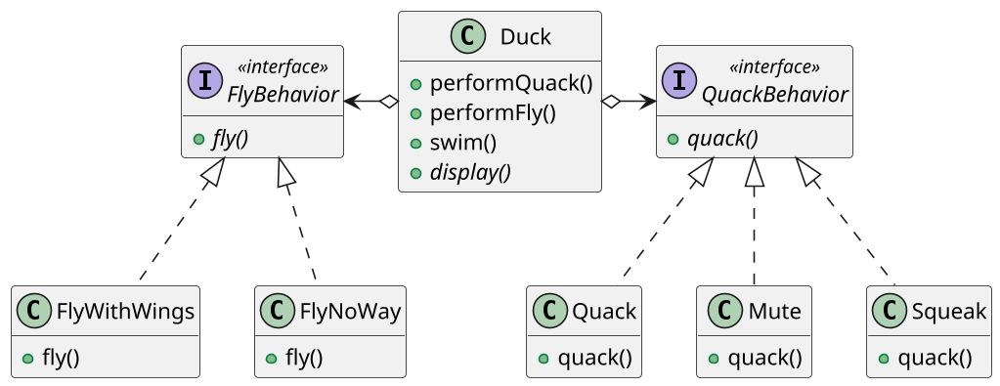
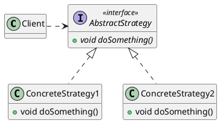

# <big>S</big>TRATEGY / <big>D</big>ELEGATION

Talvolta nelle nostre classi vogliamo definire __comportamenti diversi per diverse istanze__: la soluzione classica dei linguaggi Object-Oriented è la creazione di una gerarchia di classi in cui le classi figlie sovrascrivano i metodi della classe genitore.
Tuttavia, questo espone a delle problematiche: cosa fare se per esempio la classe genitore cambia aggiungendo un metodo che una delle classi figlie non dovrebbe poter implementare? (es. `Duck` che ha come figlia `RubberDuck`, che aggiunge il metodo `fly()` che ovviamente non potrà essere utilizzato dalla figlia)

Non volendo violare il principio Open-Close, non siamo intenzionati a rimuovere il metodo incriminato, per cui dobbiamo cercare altre soluzioni. Una prima idea sarebbe quella di sopperire al fatto che la classe genitore non sappia chi sono i suoi figli con costrutti proprietari del linguaggio:

- una classe `Final` non permette di ereditare, ma questo non ci permetterebbe di differenziare il comportamento per le diverse possibili istanze;
- una classe `Sealed` (aggiunta di Java 17) che permette di scegliere esplicitamente chi possano essere i suoi figli, specificandone il nome: in questo modo si ha controllo su chi saranno i figli e nell'implementare i nuovi metodi saprò sempre da chi verranno utilizzati successivamente, ma si tratta comunque di una soluzione parziale, che limita l'espandibilità del mio progetto, infatti non permetterò ad altri utenti, che non conosco, di creare classi figlie della mia classe.

Non si può neanche pensare di fare semplicemente l'override nella classe figlia del metodo aggiunto facendo in modo che lanci un'eccezione: si avrebbe infatti una inaccettabile violazione del principio di sostituzione di Liskov, che afferma sostanzialmente che un'istanza di una sottoclasse deve poter essere usata senza problemi al posto dell'istanza di una classe genitore.

Allora si potrebbe creare un interefaccia e non dare l'implementazione dei metodi, così facendo delego alle classi figlie la possibile implementazione dei metodi rischiosi (`fly` per la `RubberDuck` lancerebbe errore ad esempio), ma al costo di limitare la fattorizzazione. Dovrò implementare il metodo in ogni classe figlia non potendolo più fare nel padre, quindi avrò del codice ripetuto. L'introduzione di una o più classi astratte per evitarlo andrebbe a complicare molto la gerarchia.

Una soluzione migliore si basa invece sul concetto di __delega__, che sostituisce all'ereditarietà la _composizione_.
Fondamentalmente si tratta di individuare ciò che cambia nell'applicazione e separarlo da ciò che rimane fisso: si creano delle _interfacce per i comportamenti da diversificare_ e una _classe concreta che implementa ogni diverso comportamento_ possibile.
All'interno della classe originale si introducono dunque degli __attributi di comportamento__, impostati al momento della costruzione o con dei setter a seconda della dinamicità che vogliamo permettere: quando viene richiesto il comportamento a tale classe essa si limiterà a chiamare il proprio "oggetto di comportamento".
Nell'esempio delle `Duck`, per esempio, la struttura è la seguente:

Come si vede, qui non c'è scritto da nessuna parte che una `Duck` deve volare, ma solo che deve definire la sua "politica di volo" incorporando un `FlyBehaviour`.

La differenziazione dei comportamenti si fa dunque _a livello d'istanza_ e non di classe: il pattern definisce una famiglia algoritmi e li rende tra di loro intercambiabili tramite _encapsulation_.
Per questo motivo tale pattern è usato in situazioni anche molto diversa da quella con cui l'abbiamo introdotto: un altro esempio presente in Java è l'interfaccia `Comparator`.

