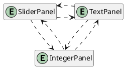
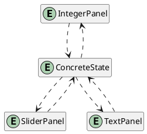
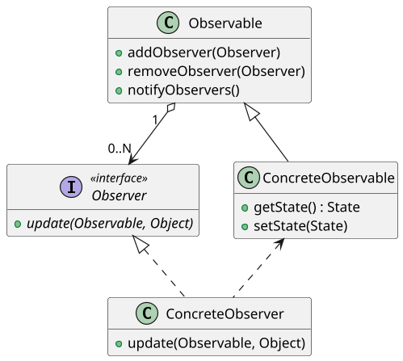
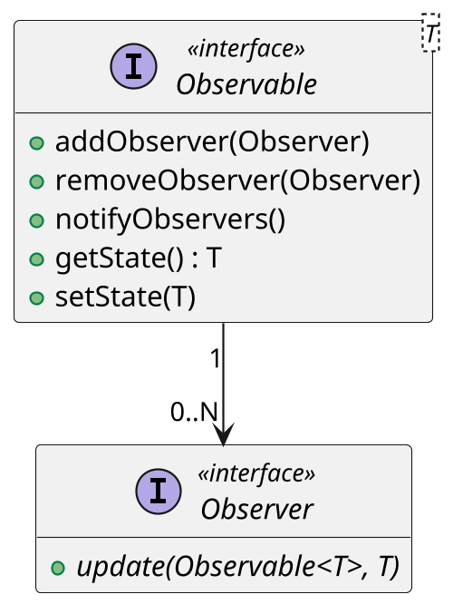

# <big>O</big>BSERVER

Molto spesso capita di avere nei nostri programmi una serie di elementi che vanno tenuti sincronizzati: pensiamo per esempio ad una ruota dei colori che deve aggiornare i valori RGB quando l'utente seleziona un punto con il mouse.
Abbiamo cioè uno __stato comune__ che va mantenuto coerente in tutti gli elementi che lo manipolano.

Nella realizzazione di questa struttura si rischia di cadere nell'__anti-pattern delle _pairwise dependencies___ in cui ogni vista dello stato deve conoscere tutte le altre.
Questo significa che tra le varie classi vi è un forte accoppiamento e una bassissima espandibilità, in quanto per aggiungere una vista dobbiamo modificare tutte le altre.
Ovviamente basta avere poco più di due viste diverse perché il numero di dipendenze (e dunque di errori) cresca esponenzialmente; questo anti-pattern viola totalmente il principio di separazione, che predicava forte coesione interna e pochi accoppiamenti esterni.



La __soluzione__ proposta dal pattern Observer è dunque quella di estrarre la parte comune (lo _stato_) e isolarlo in un oggetto a parte, detto __Subject__: tale oggetto verrà osservato da tutte le viste, le cui classi prendono ora il nome di __Observer__.
Si sta cioè __centralizzando__ la gestione dello stato, quindi saranno presenti \\( n \\) classi che osserveranno una classe centrale e reagiranno ad ogni cambiamento di stato di quest'ultima.
Si tratta una situazione talmente comune che in Java sono presenti delle classi (ora deprecate in quanto non _thread-safe_) per realizzare questo pattern: `java.util.Observer` e `java.util.Observable`.



Ma come fanno gli Observer a sapere che il Subject è cambiato?
L'idea di fare un continuo _polling_ (chiedo "Sei cambiato?" al Subject), non è ovviamente sensata, in quanto sarebbe dipendente dal tempo che passa tra una richiesta e l'altra, di conseguenza esiste il rischio di una risposta troppo lenta oppure un eccessivo utilizzo di risorse.
La soluzione è invece quella di invertire la responsabilità con un'architettura __event-driven__: gli Observer si _registrano_ al Subject, che li informerà al cambiamento di stato.



Restano però da capire un paio di cose.
Bisogna innanzitutto spiegare _come colleghiamo Observer e Subject_: come si vede in figura, esiste una classe `Observable` che funge da base da cui ereditare per ogni Subject; vi è poi un'interfaccia `Observer` che gli Observer concreti devono ovviamente implementare.

A questo punto gli Observer si possono sottoscrivere al Subject semplicemente attraverso l'uso delle sue funzioni `addObserver()` e `removeObserver()`, venendo così sostanzialmente inseriti o rimossi nella lista interna degli Observer interessati. \
Una volta che lo stato del Subject viene cambiato, solitamente attraverso una serie di metodi pubblici che permettano a tutti di modificarlo (`setState()`), esso chiama dunque il suo metodo `notifyObservers()`: questo altro non fa che ciclare su tutti gli Observer sottoscritti chiamandone il metodo `update(Observable, Object)`, dove:

- `Observable` è il Subject di cui è stato modificato lo stato (l'uso di interfacce permette di sottoscrivere un Observer a più Subject tra cui disambiguare al momento dell'update)
- `Object` è la parte di stato che è cambiata (_Object_ perché il tipo dipende ovviamente dal Subject in questione)

Sul metodo di notifica del cambiamento di stato esistono però due diverse filosofie, __push__ e __pull__, ciascuna con i suoi campi applicativi prediletti: vediamole dunque singolarmente, evidenziando quando e come esse sono utilizzate.

## push

In questo caso l'argomento Observable di `update` viene messo nullo, mentre __nell'Object viene passata la totalità dello stato__ del Subject:

```java
// Observable
@Override
public void notifyObservers() {

    for (Observer observer : observers) {
        observer.update(null, state);
    }

}

// Observer
@Override
public void update(Observable model, Object state) {

    if (state instanceof Integer intValue) {
        doSomethingOn(intValue);
    }

}
```

Come si vede, dovendo definire come reagire al cambiamento di stato in `update` l'Observer dovrà innanzitutto fare un down-casting per ottenere un oggetto della classe corretta.
Avendo la responsabilità di tale casting l'Observer dovrà conoscere precisamente la struttura dello stato del Subject, creando una _forte dipendenza_ che potrebbe creare problemi di manutenibilità.

Un altro problema di questo approccio è che gli Observer sono solitamente interessati a una piccola porzione dello stato del Subject, quindi passarlo tutto come parametro potrebbe sovraccaricare inutilmente la memoria.

## pull

Con questo approccio, invece di mandare lo stato all'`update` __viene passato il Subject stesso__, il quale conterrà uno o più metodi per accedere allo stato (`getState`):

```java
// Observable
@Override
public void notifyObservers() {

    for (Observer observer : observers) {
        observer.update(this, null);
    }

}

// Observer
@Override
public void update(Observable model, Object state) {

    if (model instanceof ConcreteObservable cModel) {
        doSomethingOn(cModel.getState());
    }

}
```

Sebbene comporti un passaggio in più poiché l'Observer deve chiamare un metodo del Subject quando riceve la notifica, questo cambio di prospettiva offre due vantaggi: in primo luogo non viene passato tutto lo stato, il che fa risparmiare molta memoria; inoltre, il Subject potrebbe decidere di rendere disponibili sottoinsiemi diversi dello stato con getter diversi, mostrando così ad ogni Observer solo le informazioni per esso rilevanti.

Inoltre, sebbene anche in questo caso sia richiesto un casting (da Observable al Subject), questo approccio rende meno dipendenti dalla rappresentazione interna del Subject: fintanto che la firma dei getter non cambia lo stato interno del Setter può cambiare senza problemi.

## Approccio ibrido e dipendenze

Partiamo col dire che molto spesso nei casi reali gli approcci _push_ e _pull_ sono ibridati tra di loro: ad `update` viene passato sia il Subject che quella parte di stato utile a tutti gli Observer, mentre qualora gli serva qualcosa di più specifico essi se lo andranno a prendere con il getter.

Il vero problema di entrambi gli approcci è però quello delle dipendenze: nel caso _push_ dipendiamo dalla rappresentazione interna del Subject, mentre nel caso _pull_ dalla sua classe concreta.
Poiché tale dipendenza non è facilmente eliminabile, piuttosto che lasciarla nascosta nel casting conviene __esplicitarla__:

- all'interno dell'Observer salvo l'istanza di Observable a cui mi sono sottoscritto, così al momento dell'`update` posso verificare direttamente che l'istanza sia quella al posto di fare un casting;

- creiamo una classe `State` e l'aggreghiamo sia nell'Observer che nell'Observable concreto in modo che essa nasconda la rappresentazione reale dello stato.

Otteniamo dunque un codice simile al seguente:

```java
public class State { /* rappresentazione interna dello stato */ }

public class Observable {
    private State stato;
    private List<Observer> observers = new ArrayList<>();

    public void addObserver(@NotNull Observer obs) { observers.add(obs); }
    public void removeObserver(@NotNull Observer obs) { observers.remove(obs); }
    public void notifyObservers() {
        for (Observer obs: observers) update(this, stato);
    }
}

public class Subject extends Observable {

    public void setState(State nuovoStato) { ... }
    public State getState() { return super.stato; }
    /* Opzionale: altri metodi getter */
}

public interface Observer {
    public void update(Observable subject, Object stato);
}

public class ConcreteObserver {
    private Observable mySubject;

    @Override
    public void update(Observable subject, Object stato) {
        if (subject == mySubject) {
            ...
        }
    }
}
```

## Versione generica del pattern Observer
È possibile sfruttare i __generici__ per evitare l'utilizzo dell'`instanceof`, evitando cosi l'utilizzo del casting (l'instanceof è un casting implicito di fatto), che di norma è una brutta pratica.
Utilizzando i generici è possibile fare in modo che il tipo venga dichiarato al momento della creazione, in modo che i controlli statici verranno fatti su quel tipo, e quindi non verranno più eseguiti a runtime tramite l'instanceof; in questo modo il problema della dipendenza visto fino ad ora non si presenta più.

Ecco quindi la parte fredda del pattern Observer sfruttando i generici:



Utilizzando due interfacce è possibile rendere questo pattern il più possibile generico e implementabile in ogni situazione.

```Java
interface Observer<T> {
    void update(Observable<T> model, T state);
}

interface Observable<T> {
    void addObserver(Observer<T> observer);
    void removeObserver(Observer<T> observer);
    void notifyObservers();
    T getState();
}
```

### Esempio di utilizzo:

Stato che rappresenta una temperatura

```Java
public class State {
    private double temp;
    
    public State(double temp) {
        this.temp = temp;
    }
    
    public double getTemp() {
        return temp;
    }
    
    public void setTemp(double temp) {
        this.temp = temp;
    }
}
```

Lo stato viene reso osservabile tramite l'interfaccia appena mostrata (viene sfruttato anche il pattern Adapter perchè vengono mappate alcuni metodi dello stato sui metodi dell'interfaccia Observable)

```Java
public class Model extends State implements Observable<Double> {
    private final List<Observer<Double>> observers = new ArrayList<>();
    @Override public void addObserver(Observer<Double> observer) {
        observers.add(observer);
    }
    
    @Override public void removeObserver(Observer<Double> observer) {
        observers.remove(observer);
    }

    @Override public void notifyObservers() {
        for (Observer<State> observer : observers)
            observer.update(this, getState());
    }

    @Override public Double getState() {
        return getTemp();
    }
    
    @Override public void setTemp(Double state) {
        super.setTemp(state);
        notifyObservers();
    }
}
```

L'unico difetto di questa implementazione è che all'esecuzione di `notifyObservers` nel metodo `setTemp` non vi è la certezza che il valore sia cambiato.