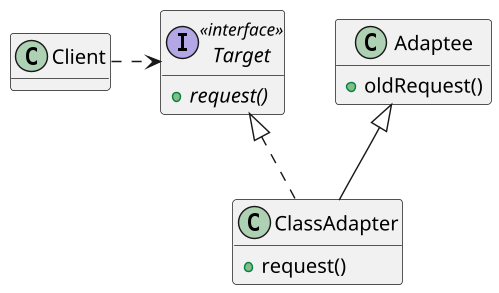
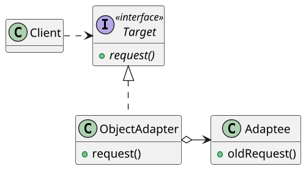

# <big>A</big>DAPTER

Spesso nei programmi che scriviamo capita di dover __far collaborare interfacce diverse__ di componenti non originariamente sviluppati per lavorare insieme.
Questo capita in una miriade di situazioni, ma volendone citare alcune:

- in un ambito di sviluppo COTS (_Component Off The Shelf: sviluppiamo solo ciò che non è disponibile tramite librerie o codice open-source_) riutilizziamo tanti componenti presi dal mercato, non pensati per essere compatibili;
- sviluppando ed evolvendo un programma in modo _incrementale_ capita di dover integrare componenti nuovi con componenti vecchi (_legacy_) per garantire una certa continuità nell'esperienza utente.

Da tutta una serie di situazioni simili è nato il bisogno di creare delle strutture che permettessero di rendere compatibili componenti già esistenti, ovvero creare della _"colla"_ in grado di legare i componenti tra loro per soddisfare le specifiche del sistema.
È così ben presto scaturito il pattern __Adapter__, un pattern ormai molto diffuso che consiste nel creare vari moduli che possano essere incollati o adattati ad altre strutture in modo da renderle utilizzabili incrementalmente e in modo controllato. 

Sebbene sia già utilizzato molto spesso, talvolta anche inconsciamente, approfondiamo il pattern in questa sede non solo per imparare a usarlo con più criterio, ma anche perché di esso esistono due "versioni":

- __Class Adapter__: adatta una classe.
- __Object Adapter__: adatta un oggetto di una classe.

Come vedremo, questi due pattern sono molto simili a livello di schema UML ma abbastanza differenti da rendere importante capire quale usare in quali contesti, comprendendo vantaggi e svantaggi di entrambi.

### Class Adapter



Come si vede dallo schema UML, per permettere a un _Client_ di comunicare tramite un'interfaccia _Target_ con un componente concreto vecchio detto _Adaptee_ il Class Adapter utilizza una classe concreta che __implementa l'interfaccia Target__ e __estende la classe Adaptee__, ereditandone così i metodi e la vecchia interfaccia: all'interno di tale classe potremo dunque limitarci a _rimappare le funzionalità_ richieste dalla nuova interfaccia su quella vecchia, implementando qualcosa solo se strettamente necessario e comunque sfruttando la logica già presente della classe estesa.

```java
public class Adapter extends Adaptee implements Target {
    @Override
    public void request() {
        this.oldRequest();
    }
}
```

In questo modo il client utilizzerà l'adapter come se fosse l'oggetto completo, non accorgendosi che quando ne chiama un metodo in realtà il codice eseguito è quello appartenente alla vecchia classe già esistente: in un __unica istanza__ si sono dunque riunte l'interfaccia vecchia e quella nuova.

Vediamo dunque quali sono i pro e i contro di questo approccio. È utile innanzitutto notare che estendendo l'Adaptee la classe Adapter ha parziale accesso alla sua rappresentazione interna, un vantaggio non da poco quando si considera quanto questo faciliti l'eventuale modifica di funzionalità; inoltre, essa ne eredita le definizioni dei metodi, e se questi non devono cambiare tra la vecchia interfaccia e la nuova si può evitare di ridefinirli totalmente, risparmiando così parecchio codice.

Inoltre, un'istanza della classe Adapter può essere utilizzata attraverso __entrambe le interfacce__ in quanto implementa quella nuova ed eredita quella vecchia; questo aspetto può essere considerato sia un vantaggio che uno svantaggio: se infatti da un lato ciò è molto utile in sistemi che evolvono incrementalmente e in cui dunque alcune componenti potrebbero volersi riferire ancora alla vecchia interfaccia, d'altro canto questo aspetto impedisce di imporre tassativamente che l'oggetto sia utilizzato solo tramite l'interfaccia nuova.

Va poi notato che questo approccio perde un po' di senso nel caso in cui si debba adattare un'_interfaccia_ e non una classe, in quanto implementare entrambe le interfacce non permette di ereditare codice o funzionalità da quella vecchia.
Inoltre, il Class Adapter potrebbe presentare problemi relativi all'ereditarietà multipla, non supportata da alcuni linguaggi a oggetti (es. Java).

### Object Adapter



Come abbiamo già detto più volte, spesso conviene prediligere la _composizione_ rispetto all'ereditarietà: al pattern del Class Adapter si contrappone dunque l'Object Adapter, che invece di estendere la classe Adaptee __contiene una sua istanza__ e __delega__ ad essa tramite la vecchia interfaccia le chiamate ai metodi dell'interfaccia nuova, eventualmente operando i necessari rimaneggiamenti.

```java
public class Adapter implements Target {
    private final Adaptee adaptee;

    public Adapter(Adaptee adaptee) {
        assert adaptee != null;
        this.adaptee = adaptee;
    }

    @Override
    public void request() {
        adaptee.oldRequest();
    }
}
```

Anche in questo caso il client non si accorge di nulla, e in particolare non sarebbe nemmeno in grado di dire con certezza se l'Adapter utilizzato sia un Class Adapter o un Object Adapter: a lui la scelta del paradigma è del tutto trasparente.

Rispetto al Class Adapter l'Object Adapter presenta differenti punti di forza e di debolezza, e il primo di questi ultimi è rappresentato dal fatto che invece di avere un'unica istanza che racchiuda entrambe le interfacce con questo pattern abbiamo invece _due istanze_ (Adapter e Adaptee contenuto), cosa che può costituire un notevole spreco di memoria in certe situazioni. 

Inoltre, aver sostituito l'ereditarietà con la composizione ha lo sgradevole effetto di non permettere all'Adapter di vedere in alcun modo la rappresentazione protetta dell'Adaptee, che esso dovrà invece manipolare unicamente tramite la sua interfaccia pubblica.
Si è poi costretti a _reimplementare ogni metodo_ anche se questo non è cambiato dall'interfaccia vecchia a quella nuova, in quanto è comunque necessario operare la delega all'Adaptee.

Tuttavia, l'Object Adapter si rivela particolarmente utile nel caso ad essere adattata debba essere un'_interfaccia_: non soffrendo di problemi di ereditarietà, un Object Adapter ha la peculiarità di poter adattare chiunque implementi la vecchia interfaccia, ovvero un'intera _gerarchia_ di classi potenzialmente non ancora esistenti!

#### Class Adapter vs Object Adapter

Class Adapter e Object Adapter hanno ciascuno i propri vantaggi e svantaggi che li rendono più adatti ad essere utilizzati in diverse situazioni.
Volendo fare un confronto tra i due approcci proponiamo dunque la seguente tabella:

| Aspetto | Class Adapter | Object Adapter |
|---------|---------------|----------------|
| Accesso all'Adaptee | <span style="color:green">L'Adapter può accedere ad attribuiti e metodi protetti dell'Adaptee</span> | <span style="color:red">L'Adapter può interagire con l'Adaptee solo tramite la sua interfaccia pubblica</span>|
| Riuso del codice | <span style="color:green">Non richiede di reimplementare i metodi che non cambiano</span> | <span style="color:red">Qualunque metodo va reimplementato per fare la delega</span> |
| Uso della memoria | <span style="color:green">Un'unica istanza</span> | <span style="color:red">Due istanze obbligatorie</span> |
| Adozione delle interfacce | <span style="color:#ff9900">L'istanza può essere usata con entrambe le interfacce</span> | <span style="color:#ff9900">L'istanza può essere usata solo tramite la nuova interfaccia</span> |
| Problemi di ereditarietà multipla | <span style="color:red">Possibili</span> | <span style="color:green">No</span>|
| Adattamento delle interfacce | <span style="color:red">Non è indicato</span> | <span style="color:green">Adattando un'interfaccia può adattare un'intera gerarchia di classi</span>|
