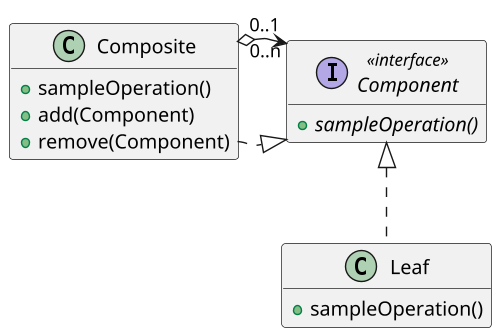
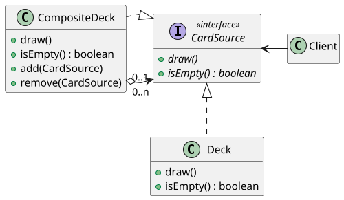

# <big>C</big>OMPOSITE

Immaginiamo di dover modellare un file system in un'applicazione: esso sarà composto di File e Directory, le quali dovranno essere in grado di contenere al loro interno File e ulteriori Directory; dovremo cioè ottenere una struttura ad albero di Directory avente dei File come foglie.
Se però molte funzionalità del file system operano in modo analogo sia sui File che sulle Directory (_es. creazione, cancellazione, ottenimento della dimensione etc._), come possiamo gestire queste due classi in modo uniforme per evitare di duplicare il codice?

Per gestire simili strutture ad albero che rappresentano _insiemi e gerarchie di parti_ viene introdotto il pattern __Composite__: esso mira a gestire oggetti singoli, gruppi e persino gruppi di gruppi in maniera uniforme e trasparente in modo che un client non interessato alla struttura gerarchica possa utilizzarli senza accorgersi delle differenze.



Abbiamo quindi gli oggetti singoli, rappresentati dalla classe _Leaf_, e gli oggetti composti rappresentati dalla classe _Composite_.
Per realizzare l'uniformità di gestione dobbiamo introdurre un livello di astrazione, quindi Leaf e Composite implementano una stessa __interfaccia Component__ contenente la definizione delle operazioni comuni. \
L'uso dell'interfaccia comune permette di definire all'interno di Composite le operazioni di aggiunta e rimozione di oggetti al gruppo in modo generale, permettendo cioè che un _Composite aggreghi sia Leaf che altri Composite_.

A proposito di tale aggregazione, dallo schema UML possiamo notare le relative cardinalità (questo è un esempio di _recursive connection_ definito nei metapattern): "0..n" dal lato del Composite e "0..1" da quello del Component.
Esse indicano che:

- Un'istanza di Composite aggrega 0 o più istanze di Component al suo interno: in questo modo è possibile che al momento della creazione il Composite sia totalmente vuoto; se questo non ha alcun senso logico nell'applicazione si può invece modificare la cardinalità in "1..n" imponendo il passaggio di un Component al costruttore;

- Un'istanza di Component può essere contenuta in al più un'istanza di Composite: questo significa che può esistere da solo oppure può essere aggregato in un gruppo, ma non può appartenere contemporaneamente a più gruppi, cosa che forza una struttura strettamente ad albero.

Nella maggior parte dei casi un'istanza Composite utilizzerà gli oggetti aggregati per implementare effettivamente i metodi descritti dall'interfaccia comune, delegando a loro l'esecuzione effettiva e limitandosi ad elaborare i risultati.
Riprendendo l'esempio di prima, per conoscere la dimensione di una Directory sarà sufficiente sommare le dimensioni dei File e delle altre Directory in essa contenuti.

Il pattern Composite presenta numerosi vantaggi, ma non è nemmeno esente da criticità.
L'uso di un'interfaccia comune per Leaf e Composite permette al client di non preoccuparsi del tipo dell'oggetto con cui sta interagendo, in quanto ogni Component è in grado di eseguire le operazioni descritte nell'interfaccia in modo indistinguibile; tuttavia, questo implica che non è possibile distinguere tra oggetti singoli e composti. \
Inoltre, l'uso dell'interfaccia rende impossibile imporre dei controlli sul contenuto di un oggetto Composite: non si può forzare l'aggregazione solo di specifici elementi, o ancora, non è possibile in alcun modo controllare la profondità dell'albero che si viene a creare.

In realtà vi sono delle differenze tra le foglie e i Composite, infatti quest'ultimi possono essere considerati come una Leaf con qualche peculiarità in più, come ad esempio la possibilità di aggiungere o rimuovere degli elemeniti dal gruppo.
Questo quindi definisce una differenza tra le due classi, ma a questo punto si pone un problema dal punto di vista dell'utente, come si può capire se un Component è una Leaf o un Composite?
Ci sono diverse possibilità, come ad esempio inserire un metodo apposito nell'interfaccia che ritorna un oggetto Composite, e in base all'implementazione deve essere tornato this oppure null.
È facilmente intuibile però che questa soluzione non è buona, infatti un miglioramente è quello di utilizzare un __casting controllato__ (altrimenti se si dovesse fare un casting di un Component il cui tipo reale è Leaf, in un oggetto Composite, si riscontrerebbero dei problemi), in cui prima di eseguire il casting si effettua un controllo sfruttando il costrutto _instanceOf_ di java.
In alternativa è possibile __spostare tutte le operazioni nell'interfaccia__, sollevando un'eccezione quando queste vengono chiamate da un oggetto Leaf.

Queste due soluzioni sono entrampe poco pulite, infatti facendo ciò si sta cercando di differenziare degli elementi che per definizione del pattern devono essere indistinguibili.

## Esempio Composite deck

Applicando questo pattern al caso del deck, possiamo modellare un mazzo generico in modo che sia formato internamente da deck o da altri gruppi di deck, in questo modo è possibile creare oggetti più complessi a partire da degli oggetti base (deck).

Il codice della classe che rappresenta deck composto sarebbe la seguente:

```java
public class CardSourceComp implements CardSource {
    @NotNull private List<CardSource> sources;
    public boolean isEmpty() {
        for(CardSource source : sources)
            if(!source.isEmpty()) return false;
        return true;
    }
} 
```

Il metodo `isEmpty` restituirà vero solo nel caso in cui tutti i `CardSource` che contiene saranno vuoti.
Utilizzando questa implementazione però il draw viene reso meno banale, perchè per simulare un'estrazione di una carta è necessario almeno pescarla da un mazzo scelto casualmente.
Quindi ci sono dei compromessi da rispettare se si sceglie di adottare il pattern, accettando tutti i pro e i contro. 
