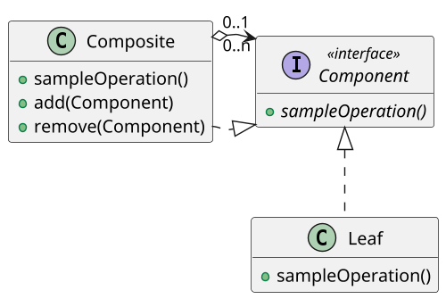

# <big>C</big>OMPOSITE

Immaginiamo di dover modellare un file system in un'applicazione: esso sarà composto di File e Directory, le quali dovranno essere in grado di contenere al loro interno File e ulteriori Directory; dovremo cioè ottenere una struttura ad albero di Directory avente dei File come foglie.
Se però molte funzionalità del file system operano in modo analogo sia sui File che sulle Directory (_es. creazione, cancellazione, ottenimento della dimensione etc._), come possiamo gestire queste due classi in modo uniforme per evitare di duplicare il codice?

Per gestire simili strutture ad albero che rappresentano _insiemi e gerarchie di parti_ viene introdotto il pattern __Composite__: esso mira a gestire oggetti singoli, gruppi e persino gruppi di gruppi in maniera uniforme e trasparente in modo che un client non interessato alla struttura gerarchica possa utilizzarli senza accorgersi delle differenze.

Abbiamo quindi gli oggetti singoli, rappresentati dalla classe _Leaf_, e gli oggetti composti rappresentati dalla classe _Composite_.
Per realizzare l'uniformità di gestione dobbiamo introdurre un livello di astrazione, quindi Leaf e Composite implementano una stessa __interfaccia Component__ contenente la definizione delle operazioni comuni. \
L'uso dell'interfaccia comune permette di definire all'interno di Composite le operazioni di aggiunta e rimozione di oggetti al gruppo in modo generale, permettendo cioè che un _Composite aggreghi sia Leaf che altri Composite_.

A proposito di tale aggregazione, dallo schema UML possiamo notare le relative cardinalità: "0..n" dal lato del Composite e "0..1" da quello del Component.
Esse indicano che:

- Un'istanza di Composite aggrega 0 più istanze di Component al suo interno: in questo modo si permette che al momento della creazione il Composite sia totalmente vuoto; se questo non ha alcun senso logico nell'applicazione si può invece modificare la cardinalità in "1..n" imponendo che al costruttore di Composite venga passato un Component iniziale da contenere;

- Un'istanza di Component può essere contenuta in al più un'istanza di Composite: può cioè essere libero o aggregato in un gruppo, ma non può appartenere contemporaneamente a più gruppi, cosa che forza una struttura strettamente ad albero.

Nella maggior parte dei casi un'istanza Composite utilizzerà gli oggetti aggregati per implementare effettivamente i metodi descritti dall'interfaccia comune, delegando a loro l'esecuzione effettiva e limitandosi ad elaborare i risultati.
Riprendendo l'esempio di prima, per conoscere la dimensione di una Directory sarà sufficiente sommare le dimensioni dei File e delle altre Directory in essa contenuti.

Il pattern Composite presenta numerosi vantaggi, ma non è nemmeno esente da criticità.
L'uso di un'interfaccia comune per Leaf e Composite permette al client di non preoccuparsi del tipo dell'oggetto con cui sta interagendo, in quanto ogni Component è in grado di eseguire le operazioni descritte nell'interfaccia in modo indistinguibile; tuttavia, questo implica che non è possibile distinguere tra oggetti singoli e composti. \
Inoltre, l'uso dell'interfaccia per l'aggregazione nei Composite rende impossibile imporre dei controlli su cosa possa contenere un certo tipo di Composite: non si può per esempio forzare che raggruppi solo certi tipi di elementi, o che l'albero di composizione abbia profondità al più pari a tre. Riguardo a questo è ancora consigliabile evitare di fare dei _casting_ poichè andrebbero a bypassare i controlli fatti dal compilatore.

Un "dialetto" del pattern tenta di risolvere il problema dell'indistinguibilità tra Leaf e Composite introducendo nell'interfaccia Component un metodo `getComposite` che in un Composite restituisca `this` e in una Leaf restituisca `null`.
L'uso di valori nulli e la necessità di strani casting rende però pericolosa l'adozione di questa versione del pattern.
