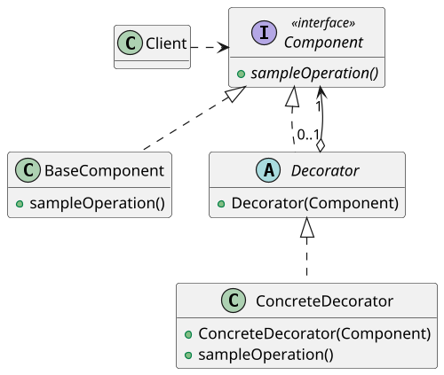

# <big>D</big>ECORATOR

Immaginiamo di voler modellare con degli oggetti una grande varietà di pizze differenti sia per la base (_es. normale, integrale, senza glutine..._) che per gli ingredienti che vi si trovano sopra.
Per ogni diversa varietà di pizza vorremmo ottenere un oggetto aderente a un'interfaccia comune `Pizza` il cui metodo `toString()` elenchi la base e gli ingredienti che la compongono.

Un primo approccio _statico_ a questo problema consiste nel creare una gerarchia di classi che contenga una classe per ogni possibile combinazione di base e ingredienti, che d'ora in avanti chiameremo "__decorazioni__".

```java
public interface Pizza {}

public class BaseNormale implements Pizza {
    public String toString() { 
        return "Sono una pizza con: base normale"; 
    }
}

public class BaseIntegrale implements Pizza {
    public String toString() { 
        return "Sono una pizza con: base integrale"; 
    }
}

public class BaseNormaleSalame extends BaseNormale {
    public String toString() { 
        return "Sono una pizza con: base normale, salame"; 
    }
}

public class BaseNormaleSalamePeperoni extends BaseNormaleSalame {
    public String toString() {
        return "Sono una pizza con: base normale, salame, peperoni"; 
    }
}

...
```

Come è subito ovvio si tratta di un __anti-pattern__, è assolutamente da evitare per una serie di motivi: in primo luogo l'esplosione combinatoria dovuta all'accoppiamento di ogni possibile base e insieme di decorazioni, e in secondo luogo l'estrema difficoltà che comporterebbe una futura aggiunta di decorazioni.

L'ideale sarebbe invece poter __aggiungere funzionalità e caratteristiche dinamicamente__, restringendo la gerarchia ad un'unica classe le cui istanze possano essere "decorate" su richiesta al momento dell'esecuzione. \
La soluzione più semplice a questo nuovo problema parrebbe quella che viene definita una <big>G</big>OD CLASS (o _fat class_), ovvero un'unica classe in cui tramite attributi booleani e `switch` vengono attivate o disattivate diverse decorazioni.

```java
public class GodPizza {

    boolean baseNormale = false;
    boolean baseIntegrale = false;
    ...

    boolean salame = false;
    boolean pancetta = false;
    boolean peperoni = false;
    ...

    public void setBaseNormale(boolean status) { baseNormale = status; }
    public void setBaseIntegrale(boolean status) { baseIntegrale = status; }
    ...

    public void setSalame(boolean status) { salame = status; }
    public void setPancetta(boolean status) { pancetta = status; }
    public void setPeperoni(boolean status) { peperoni = status; }
    ...

    public String toString() {
        StringBuilder sb = new StringBuilder("Sono una pizza con: ");
        if (baseNormale) sb.append("base normale, ");
        if (baseIntegrale) sb.append("base integrale, ");
        ...
        if (salame) sb.append("salame, ");
        if (pancetta) sb.append("pancetta, ");
        if (peperoni) sb.append("peperoni, ");
        ...
        sb.removeCharAt(sb.length() - 1);
        sb.removeCharAt(sb.length() - 1);
        return sb.toString();
    }
}
```

Si tratta pure questo di un chiaro __anti-pattern__, una soluzione che sebbene invitante e semplice in un primo momento da realizzare nasconde delle criticità non trascurabili.
Si tratta infatti di una chiara violazione dell'Open-Close Principle, in quanto per aggiungere un decoratore è necessario modificare la God Class; inoltre, tale classe diventa molto velocemente gigantesca, zeppa di funzionalità tra loro molto diverse (_scarsa separazione delle responsabilità_) e decisamente infernale da leggere, gestire e debuggare in caso di errori.

Introduciamo dunque il pattern __Decorator__, la soluzione più universalmente riconosciuta per questo tipo di situazioni.



A prima vista lo schema UML ricorda molto quello del pattern Composite: abbiamo un'interfaccia _Component_ implementata sia da un _ConcreteComponent_, ovvero una base della pizza nel nostro esempio, sia da una __classe astratta Decorator__, la quale è poi estesa da una serie di _ConcreteDecorator_.
A differenza del Composite, tuttavia, qui ciascun Decorator aggrega __una e una sola istanza di Component__: tali decoratori sono infatti dei "wrapper", degli oggetti che _ricoprono_ altri per aumentarne dinamicamente le funzionalità. \
È importante notare che i Decorator ricevono come oggetto da ricoprire al momento della costruzione un _generico Component_, in quanto questo permette ai decoratori di decorare oggetti già decorati.
Questo approccio "ricorsivo" permette di creare una catena di decoratori che definisca a _runtime_ in modo semplice e pulito oggetti dotati di moltissime funzionalità aggiunte, così facendo alleggeriremo la fase di compiling, aggiungendo determinate funzionalità dinamicamente. \
I decoratori esporranno infatti i metodi definiti dall'interfaccia __delegando__ al Component contenuto l'esecuzione del comportamento principale e aggiungendo la propria funzionalità a posteriori: in questo modo la "base" concreta eseguirà il proprio metodo che verrà successivamente arricchito dai decoratori in maniera del tutto trasparente al Client.

```java
public interface Pizza { String toString(); }

public class BaseNormale implements Pizza {
    public String toString() { 
        return "Io sono una pizza con: base normale"; 
    }
}

public class BaseIntegrale implements Pizza {
    public String toString() { 
        return "Io sono una pizza con: base integrale"; 
    }
}

public abstract class IngredienteDecorator implements Pizza {
    private Pizza base;

    public IngredienteDecorator(Pizza base) { this.base = base; }

    public String toString() {
        return base.toString();
    }
}

public class IngredienteSalame extends IngredienteDecorator {
    public IngredienteSalame(Pizza base) { super(base); }

    @Override
    public String toString() { return super.toString() + ", salame"; }
}

public class IngredientePeperoni extends IngredienteDecorator {
    public IngredientePeperoni(Pizza base) { super(base); }

    @Override
    public String toString() { return super.toString() + ", peperoni"; }
}
```

```java
public class Client {
    public static void Main() {
        // Voglio una pizza con salame, peperoni e base integrale
        Pizza salamePeperoni = 
            new IngredientePeperoni(
                new IngredienteSalame(
                    new BaseIntegrale()
                )
            );
    }
}

```

Vista la somiglianza, inoltre, pattern Decorator e Composite sono facilmente combinabili: si può per esempio immaginare di creare gruppi di oggetti decorati o decorare in un solo colpo gruppi di oggetti semplicemente facendo in modo che Composite, Decorator e classi concrete condividano la stessa interfaccia Component. Un esempio comune ne sono i programmi di photo-editing dove possiamo unire diversi elementi tra loro e applicare a tutti lo stesso effetto.

Possiamo poi notare una cosa: al momento della costruzione un Decorator salva al proprio interno l'istanza del Component da decorare.
Come sappiamo questo darebbe luogo ad un'_escaping reference_, ma in questo caso il comportamento è assolutamente voluto: dovendo decorare un oggetto è infatti sensato pensare che a quest'ultimo debba essere lasciata la possibilità di cambiare e che debba essere il decoratore ad adattarsi a tale cambiamento.


È interessante poi osservare la classe astratta Decorator: in essa viene infatti inserita tutta la logica di composizione, permettendo così di creare nuovi decoratori con estrema facilità.
Spesso, inoltre, se i decoratori condividono una certa parte di funzionalità aggiunte queste vengono anch'esse estratte nella classe astratta creando invece un metodo vuoto protetto che i decoratori reimplementeranno per operare la loro funzionalità aggiuntiva.

```java
public abstract class IngredienteDecorator implements Pizza {
    private Pizza base;

    public IngredienteDecorator(Pizza base) { this.base = base; }

    public String toString() {
        return base.toString() + nomeIngrediente();
    }

    protected String nomeIngrediente() { return ""; }
}

public class IngredienteSalame extends IngredienteDecorator {
    public IngredienteSalame(Pizza base) {super(base);}

    @Override
    public String nomeIngrediente() { return ", salame"; }
}

public class IngredientePeperoni extends IngredienteDecorator {
    public IngredientePeperoni(Pizza base) {super(base);}

    @Override
    public String nomeIngrediente() { return ", peperoni"; }
}
```

Si noti come l'uso della visibilità `protected` renda l'override del metodo possibile anche al di fuori del package, aumentando così la facilità di aggiunta di nuovi decoratori.

Volendo vedere un esempio concreto di utilizzo di questo pattern è sufficiente guardare alla libreria standard di Java: in essa infatti gli `InputStream` sono realizzati seguendo tale schema.
