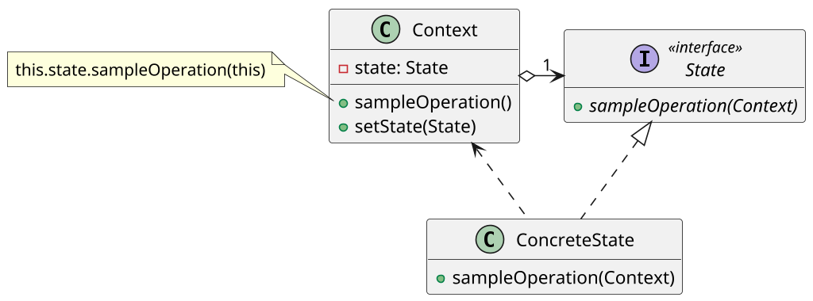

# <big>S</big>TATE

Come sappiamo, le macchine a stati finiti sono uno dei fondamenti teorici dell'informatica: si tratta di oggetti matematici che modellano sistemi in grado di evolvere, ovvero il cui __comportamento varia in base allo stato__ in cui si trovano.

Volendo rappresentare un oggetto di questo tipo la prima idea potrebbe essere quella di realizzare il cambio di comportamento con una serie di `if` e `switch`, un approccio che come abbiamo già visto numerose volte diventa presto difficilmente sostenibile. \
In alternativa ad esso si introduce invece lo __State pattern__ che mantenendo l'astrazione delle macchine a stati finiti permette di modellare facilmente il cambiamento di comportamento di un oggetto al modificarsi dello stato.
Si noti che rimanendo legato al concetto di automa a stati finiti uno dei punti di forza di questo pattern è la semplicità di apportare delle modifiche al codice quando le specifiche di ciò che è stato modellato tramite una macchina a stati finiti cambiano.

Un esempio di utilizzo di questo pattern potrebbe essere un software di editing di foto, in cui l'utente ha a disposizione una toolbar con diversi strumenti che gli permettono di compiere operazioni diverse sullo stesso piano di lavoro (_comportamenti diversi dell'azione "tasto sinistro sullo schermo" in base al tool selezionato_).



In un automa a stati finiti le componenti fondamentali sono tre:

- gli _stati_, tra cui si distingue lo _stato corrente_;
- le _azioni_ che si possono intraprendere in qualunque stato;
- le _transizioni_ da uno stato all'altro come effetto ulteriore di un'azione (_es. vim che con 'i' entra in modalità inserimento se era in modalità controllo_).

Come si vede dallo schema UML, il pattern State cerca di modellare ciascuna di queste componenti: un'__interfaccia State__ raggruppa la definizione di tutte le _azioni_, rappresentate da metodi, mentre __una classe concreta per ogni stato__ definisce che effetto hanno tali azioni quando ci si trova al suo interno con l'implementazione dei suddetti metodi. \
Infine, una classe __Context__ contiene un riferimento ad uno stato che rappresenta lo _stato corrente_ e delega ad esso la risposta alle azioni (che possono essere viste come degli "eventi"); essa espone inoltre un metodo `setState(State)` che permette di modificare lo stato corrente.

```java
public class Context {
    private State state;

    public void setState(@NotNull State s) {
        state = s;
    }

    public void sampleOperation() {
        state.sampleOperation(this)
    }
}
```

Rimane dunque solo da definire come si realizzano le _transizioni_ di stato: chi ha la responsabilità di cambiare lo stato corrente?
Esistono due diversi approcci, ciascuno dei quali presenta delle criticità:

- __gli State realizzano le transizioni__: volendo rimanere aderenti al modello degli automi a stati finiti, possiamo permettere che gli stati concreti chiamino il metodo `setState` del Context all'interno della loro implementazione dei metodi se come effetto di un'azione lo stato corrente cambia.
Tuttavia, poiché `setState` chiede in input lo stato a cui transizionare questo approccio richiede che _gli stati si conoscano tra di loro_: si introduce così una _dipendenza tra stati_ non chiaramente visibile nello schema UML e si ha uno _sparpagliamento della conoscenza_ sulle transizioni che rende questo metodo un po' "sporco".

- __il Context realizza le transizioni__: con questa seconda strategia è compito del contesto eseguire le transizioni di stato, evitando così che gli stati si debbano conoscere; l'unico depositaria della conoscenza sulle transizioni è la classe Context.
Ciascuna azione viene dunque intrapresa in due step: il Context richiama il corrispondente metodo dello stato corrente e successivamente ne __intercetta il risultato__; può dunque decidere tramite esso se cambiare stato e eventualmente a quale stato transizionare. \
Si tratta tuttavia di un ritorno al _table-driven design_ fatto di `if` e `switch` da cui ci eravamo voluti allontanare: come in quel caso, l'approccio risulta fattibile soltanto finché ci sono poche possibili transizioni.
Inoltre, se una transizione non dipende dal risultato di un'azione ma da _come_ questa è stata eseguita questo approccio è totalmente impossibile in quanto tale tipo di conoscenza non è presente nella classe Context.

Per via delle difficoltà poste dal secondo approccio si sceglie spesso di effettuare le transizioni all'interno degli stati: questo permette di rendere esplicito e atomico il passaggio di stato. \
A tal proposito, è interessante notare come le istanze degli stati concreti non posseggano alcuna informazione di stato in quanto il Context a cui si riferiscono viene passato loro al momento della chiamata dei rispettivi metodi: al di là della loro identità essi sono completamente __stateless__.
Si tratta di un approccio molto utile in caso si debbano modellare più macchine a stati finiti dello stesso tipo, in quanto l'assenza di stato rende le stesse istanze degli stati concreti __condivisibili__ tra diversi Context, in una sorta di pattern Singleton.

Volendo trovare ulteriori analogie con altri pattern, il pattern State ricorda nello schema il pattern Strategy: la differenza sta però nel fatto che i diversi stati concreti sono a conoscenza l'uno dell'altro, mentre le strategie erano tra di loro completamente indipendenti.
