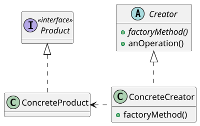
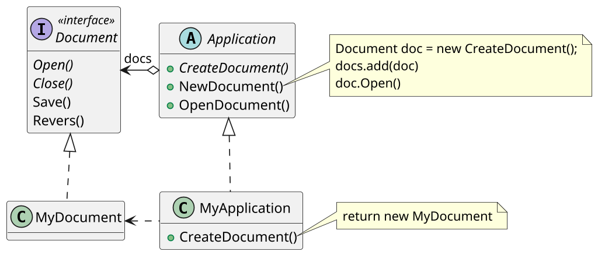

# <big>F</big>ACTORY METHOD

Talvolta capita che un certo Client sia interessato a creare un oggetto non in base al suo tipo quanto all'_interfaccia_ che esso implementa: ad esso non importa conoscere la classe di cui l'oggetto è un'istanza perché essa non ha alcuna rilevanza nel suo contesto.
Tuttavia, la normale creazione di un oggetto tramite la keyword `new` richiede di esplicitare la classe a cui esso appartiene, costringendo così il Client ad approfondire inutilmente la sua conoscenza sui tipi che implementano l'interfaccia a cui è interessato.

Per evitare questo tipo di situazione introduciamo uno dei cosiddetti __pattern creazionali__, ovvero legati alla creazione di oggetti: stiamo parlando del pattern dei __Factory methods__.
Esso definisce una classe astratta _Creator_ dotata di _metodi fabbrica_ astratti che restituiscono un'istanza di un tipo aderente all'interfaccia _Product_ a cui il Client è interessato: a quale classe appartenga effettivamente tale istanza (_Product concreto_) è però lasciato ad un _Creator concreto_ tra i tanti che estendono la classe astratta; idealmente dovrebbe esserci un creatore concreto per ogni tipo di prodotto concreto che implementa l'interfaccia Product.

Questo pattern definisce dunque un'__interfaccia per creare un Product ma lascia al Creator concreto la scelta di cosa creare effettivamente__: in questo modo all'interno della classe astratta Creator è possibile scrivere dei metodi che richiedono la creazione di un Product pur senza sapere di preciso il tipo dell'oggetto che verrà creato, in quanto questo sarà determinato dall'implementazione di `factoryMethod` del creatore concreto.
Si sfruttano dunque al massimo grado __polimorfismo__ e __collegamento dinamico__, in quanto il tipo dell'oggetto da creare viene deciso a runtime: poiché nemmeno il Creator conosce il tipo concreto dei Product creati risulta dunque subito chiaro perché i factory methods non possano essere metodi statici di tale classe. \
I factory methods rappresentano un esempio dell'utilità delle astrazioni permesse dai linguaggi ad oggetti: in un contesto in cui normalmente non è possibile fare overriding, come un costruttore, la soluzione è quella di virtualizzare il tutto con la creazione di metodi che possono essere esportati in classi concrete.
Per questo motivo i factory method vengono talvolta detti anche _virtual constructors_, "costruttori virtuali".

Per capire meglio il funzionamento del pattern, vediamo un esempio di come esso può essere utilizzato.
Consideriamo un software capace di aprire contemporaneamente più documenti di tipo differente in diverse pagine, come per esempio Microsoft Word o Excel: al loro interno, quando viene creato un nuovo file vengono fatte una serie di operazioni generiche (creare la nuova pagina, mostrare vari popup...), ma ad un certo punto è necessario creare un oggetto che rappresenti il nuovo documento e il cui tipo dipende dunque dal documento creato.
Il codice di creazione del nuovo oggetto `Documento` non può dunque trovarsi in un metodo della classe astratta `Application` (Creator) insieme con il resto delle operazioni generiche in quanto specifico della tipologia di documento creato: è dunque necessario virtualizzare la creazione dell'oggetto in un metodo `createDocument()` implementato da una serie di sottoclassi concrete `MyApplication` (ConcreteCreator) ciascuna specifica per un tipo di documento.

