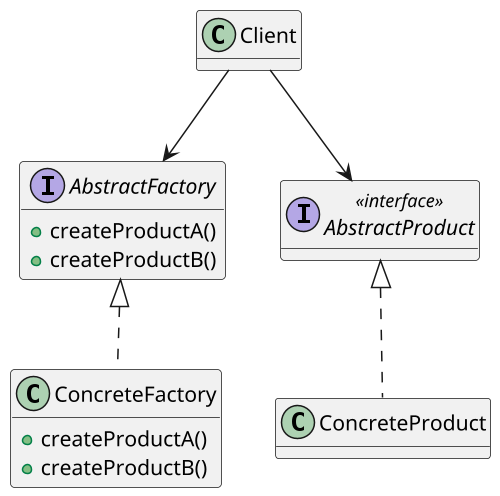

# <big>A</big>BSTRACT FACTORY

Vediamo ora una generalizzazione del Factory method pattern che si utilizza quando, al posto di creare un solo oggetto aderente ad un'interfaccia, è necessario creare _più oggetti aderenti a varie interfacce i cui tipi concreti siano però compatibili tra di loro_.

Immaginiamo per esempio di aver progettato un'applicazione cross-platform e di doverne creare la User Interface: essa dovrà avere stili diversi in base al sistema operativo sui cui si sta eseguendo.
Non conoscendo su quale os si starà operando, il resto dell'applicazione gestirà gli elementi dell'UI tramite delle opportune interfacce che nascondano il tipo concreto delle istanze, il quale determinerà lo stile con cui esse verranno rappresentate: sarà però fondamentale che _tutti gli elementi dell'UI condividano lo stesso stile_ in modo da non creare un'orrendo arlecchino.

Ecco dunque che introduciamo il pattern delle __Abstract Factory__, un metodo in grado di fornire un'__interfaccia per creare famiglie di oggetti compatibili tra loro senza specificare la loro classe concreta__ così da garantire una certa __omogeneità__ all'insieme. \
Per fare ciò il pattern propone di creare un'interfaccia _AbstractFactory_ contenente la definizione di un factory method per ogni tipo di prodotto astratto (_Product_) e una serie di _ConcreteFactory_ che restituiranno dei _ConcreteProduct_ in uno specifico stile: in questo modo, interagendo con una Factory concreta un Client potrà ottenere in modo a lui trasparente una serie di prodotti concreti coerenti in stile tra di loro.

Tornando al problema della User Interface, volendo sfruttare l'Abstract Factory pattern dobbiamo creare un'interfaccia `GUIFactory` che contenga la dichiarazione di due metodi creazionali, `createButton()` e `createCheckbox()`: questi permetteranno al client di creare un bottone e una checkbox nello stile specificato dalla classe concreta della factory; per ciascuno di tali elementi dell'UI dobbiamo dunque creare un'interfaccia prodotto, ovvero rispettivamente le interfacce `Button` e `Checkbox`.
All'interno delle classi factory concrete tali metodi creazionali restituiranno però dei prodotti concreti nello stile specifico della factory da cui sono prodotti: così, per esempio, una `MacFactory` (per lo stile di MacOs) creerà `MacButton` e `MacCheckbox`, mentre una `WinFactory` (per lo stile di Windows) creerà `WindowsButton` e `WinCheckbox`. \
In questo modo la nostra applicazione dovrà possedere al suo interno unicamente un riferimento alla factory adatta al sistema operativo su cui sta girando e potrà creare tramite essa tutti gli elementi di UI di cui avrà bisogno senza preoccuparsi di specificare ogni volta lo stile: la factory concreta glielo restituirà sempre nello stile selezionato inizialmente.

