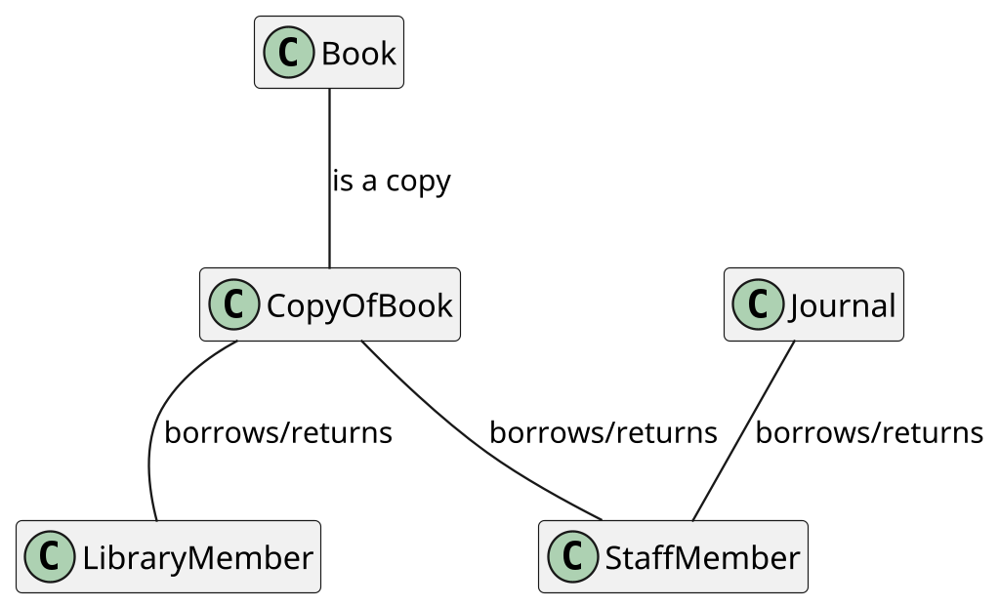
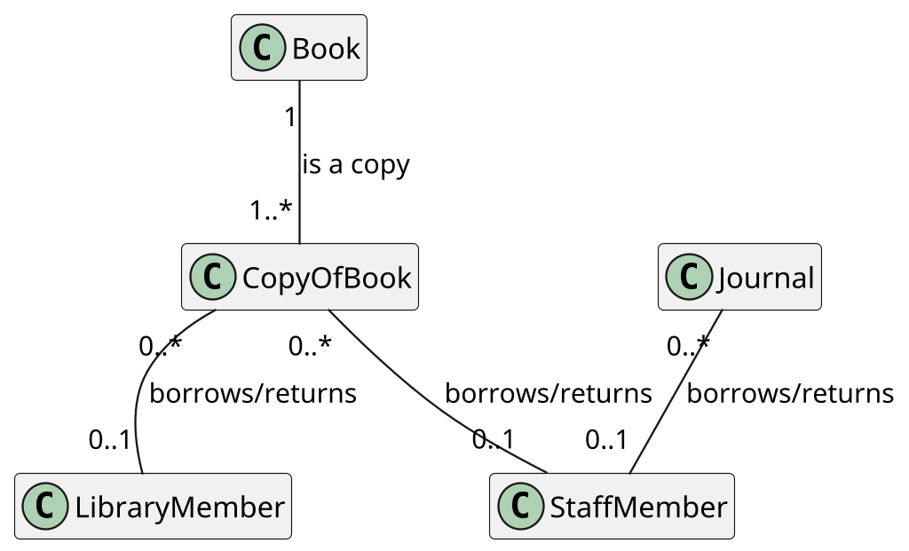
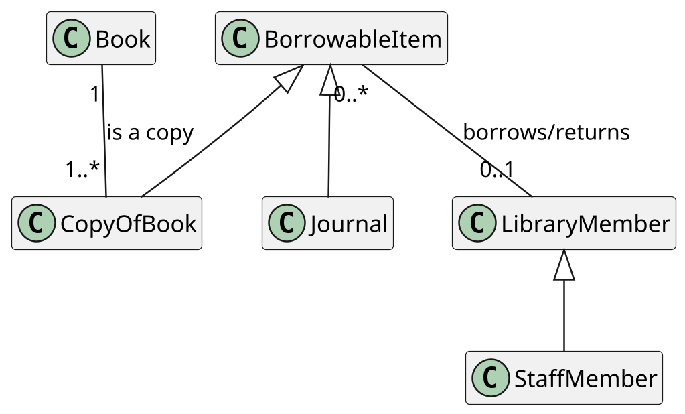
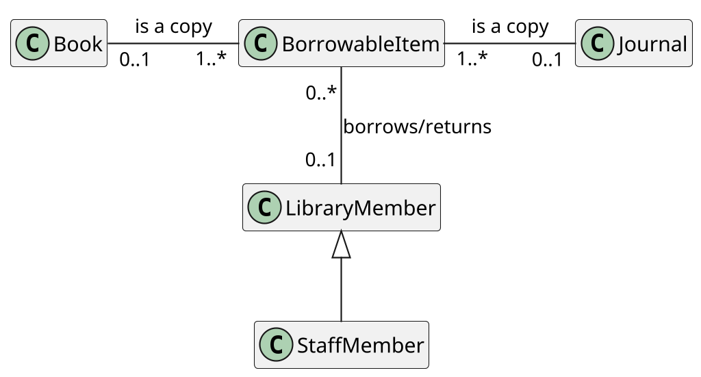

# Analisi del testo naturale

Come organizzare la partenza del design suddividendo in classi e responsabilità?

I due approcci principali sono:

- __pattern__: riconoscere una situazione comune da una data;
- __TDD__: partendo dalla soluzione più semplice si definiscono classi solo all'occorrenza.

Un'altra tecnica che vedremo è l'__estrazione dei nomi__ (noun extraction), per un certo senso _naive_ ma adatta in caso
di storie complesse.

## Noun extraction

Basandosi sulle specifiche &mdash; come i commenti esplicativi delle User Stories &mdash; si parte dai sostantivi (o
frasi sostantivizzate), si _sfoltiscono_ con dei criteri, si cercano le relazioni tra loro e quindi si produce la
gerarchia delle classi.

Per spiegare il procedimento considereremo il seguente esempio:

> - _The __library__ contains __books__ and __journals__.
    > It may have several __copies__ of a given book.
    > Some of the books are for __short term loans__ only.
    > All other books may be borrowed by any __library member__ for three __weeks__._
> - ___Members of the library__ can normally borrow up to six __items__ at a time, but __members of staff__ may borrow
    up to 12 items at one time.
    > Only member of staff may borrow journals._
> - _The __system__ must keep track of when books and journals are borrowed and returned, enforcing the __rules__
    described above._

Nell'esempio sopra sono stati evidenziati i sostantivi e le frasi sostantivizzate.

### Criteri di _sfoltimento_

I criteri di _sfoltimento_ servono per diminuire il numero di sostantivi considerando solo quelli rilevanti per
risolvere il problema.
In questa fase, in caso di dubbi è possibile rimandare la decisione a un momento successivo.

Di seguito ne sono riportati alcuni:

- __Ridondanza__: sinonimi, termini diversi per indicare lo stesso concetto. Anche se è stata utilizzata una locuzione
  diversa potrebbe essere comunque ridondante, sopratutto in lingue diverse dall'inglese in cui ci sono molti
  sinonimi. \
  Nell'esempio: _library member_ e _member of the library_, _loan_ e _short term loan_.
- __Vaghezza__: nomi generici, comuni a qualunque specifica; potrebbero essere sintomo di una _classe comune
  astratta_. \
  Nell'esempio: _items_.
- __Nomi di eventi e operazioni__: nomi che indicano azioni e non hanno un concetto di _stato_. \
  Nell'esempio: _loan_.
- __Metalinguaggio__: parti _statiche_ che fanno parte della logica del programma e che quindi non necessitano di essere
  rappresentati come classi. \
  Nell'esempio: _system_, _rules_.
- __Esterne al sistema__: concetti esterni o verità _"assolute"_ al di fuori del controllo del programma. \
  Esempio: _library_, _week_ (una settimana ha 7 giorni).
- __Attributi__: informazioni atomiche e primitive (stringhe, interi, ...) relative a una classe, che quindi non
  necessitano la creazione di una classe di per sé. \
  Esempio: _name of the member_ (se ci fosse stato).

Al termine di questa fase, si avrà una lista di classi _"certe"_ e _"incerte"_.
In questo esempio, sono sopravvissuti i termini _journal_, _book_, _copy_ (of _book_), _library member_ e _member of
staff_.

### Relazioni tra classi

Il prossimo passo è definire le relazioni tra le classi.

Inizialmente, si collegano con delle _linee_ (non frecce) senza specificare la direzione dell'associazione.
Parliamo di __associazioni__ e non __attributi__ perché non è necessariamente vero che tutte le associazioni si
trasformino in attributi.

Il prossimo passo è specificare le __cardinalità__ delle relazioni, come specificato dal linguaggio UML (opposto in
questo aspetto al diagramma ER).
La precisione richiesta in questo punto è soggettiva: da una parte, specificare puntualmente il numero massimo di
elementi di una associazione può aiutare a ottimizzare successivamente, dall'altra porta confusione.

Dopo aver ragionato sulle cardinalità, si iniziano a cercare __generalizzazioni__ e fattorizzazioni.
In questo caso, notiamo che:

- `StaffMember` _è un_ `LibraryMember` con in più la possibilità di prendere `Journal`.
  Inoltre, un altro indicatore è che hanno lo stesso tipo di relazioni con gli altri oggetti.
- `Items` è un termine generico per indicare `CopyOfBook` e `Journal`.

Distinguere `CopyOfBook` e `Journal` è inutile, perché di fatto un `Journal` _è una copia di_ un giornale.
Si può quindi fattorizzare __rimuovendo la generalizzazione__, come mostrato di seguito.

È importante però preoccuparsi delle __cardinalità__ delle relazioni: è sì vero che un `BorrowableItem` può non _essere
una copia di_ un `Book` e di un `Journal`, ma deve essere copia di _esattamente_ una delle due opzioni.
UML prevede un __linguaggio OCL
__ ([Object Constraint Language](https://en.wikipedia.org/wiki/Object_Constraint_Language)) per esprimere vincoli
diversamente impossibili da esprimere in un diagramma.
È anche possibile scrivere il _constraint_ in linguaggio naturale come __nota__.

## Stato: concreto vs astratto

Considerando una singola classe (anche articolata), ciò che ne caratterizza la complessità è il numero di situazioni in
cui si può trovare, o per meglio dire __il numero di stati che può assumere__.
È possibile fare una distinzione tra:

- __Stato concreto__: il prodotto scalare di tutti i possibili valori degli attributi della classe definisce i diversi
  stati, la caratteristica di questa tipologia di stati è che il numero di combinazioni esplode molto velocemente.
  Questo lo si può capire da un semplice esempio, nel caso in cui si avesse a disposizione un solo intero il numero di
  stati possibili sarebbe \\(2^32\\), ma dal momento che gli attributi diventano due, il numero di stati risulterebbe
  essere \\(2^{32} * 2^{32} = 2^{64}\\).
  Visto l'esagerato numero di stati concreti è chiaro che non è necessario considerare ognuno di essi per capire cosa
  sta succedendo nel sistema.
- __Stato astratto__: Lo stato astratto invece rappresenta i possibili stati del sistema tramite una visione più
  generale, sfruttando un sottoinsieme arbitrario _significativo_ degli stati concreti.
  Un esempio potrebbe essere quello del caso della libreria visto in precedenza, consideriamo tutti i libri la cui
  segnatura inizi per 'L', e consideriamo questi come i libri disponibili per la sola lettura in sala, in questo modo
  non è necessario verificare ognuno di essi, ma per determinare lo stato è necessario verificare questa semplice
  condizione.

### Casi particolari

Esistono casi particolari riguardo a il concetto di stato appena mostrato:

- __Stateless object__: Sono degli oggetti che non possiedono attributi, di conseguenza non hanno uno stato.
  Questi oggetti sono detti anche oggetti funzione e rappresentano delle astrazioni funzionali di qualcosa.
- __Oggetti immutabili__: Sono oggetti che hanno un unico stato che non può cambiare. È importante distinguere una
  _Classe immutabile_ da un _Oggetto immutabile_, infatti prendendo come esempio la classe ``String`` è possibile dire
  che La _classe_ ha infiniti stati perché è possibile generare un numero quasi infinito di stringhe, mentre un
  _oggetto_ di tipo ``String`` non può essere in alcun modo modificato.