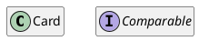
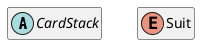
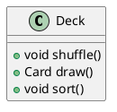
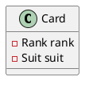

# Class diagram

## Concetto e struttura

Lo scopo del __diagramma delle classi__ è fornire una vista statica del software (una sorta di "fotografia") tramite la rappresentazione delle sue classi, corredate di metodi, attributi e relazioni.

<!-- Hardcoded diagram because the PlantUML jekyll plugin produces a malformed version -->

    <object class="plantuml" style="width: 70%" data="/assets/11_UML-base.svg"></object>

I componenti identificabili in un diagramma delle classi sono:
- __oggetti__ (_Classi_ e _Interfacce_), rispettivamente riconoscibili per le lettere "C" e "I" nella parte superiore di ogni blocco. 

 Esiste anche il marcatore "A", che rappresenta una classe astratta.
Inoltre, per i diagrammi UML relativi a Java si può usare la lettera "E" per rappresentare le classi enum;

- __metodi__: preceduti da un cerchio e dal tipo di valore ritornato;

- __attributi__: preceduti da un quadrato, corrispondono agli attributi dell'oggetto;

- __relazioni__: frecce che connettono gli oggetti.

È possibile rappresentare il _cerchio_ dei metodi e il quadrato degli attributi con colori diversi in base alla visibilità. 
In Java, ad esempio, si può usare il verde per la visibilità `public`, l'arancio per `protected` e il rosso per `private`.

Valgono anche due regole sintattiche generali:
- se una scritta è in _corsivo_ vuol dire che all'elemento corrispondente manca qualche definizione ed è dunque da considerarsi __astratto__;
- se una scritta è <u>sottolineata</u> vuol dire che l'elemento corrispondente (tipicamente metodo o attributo) è __statico__, ovvero ha una visibilità a livello di classe e non a livello di istanza (_i.e_ è possibile riferircisi ad esso anche senza avere precedentemente istanziato la classe).

### Relazioni

Nel diagramma delle classi UML esistono relazioni di diversi tipi.
Ogni relazione viene rappresentata tramite una specifica forma di freccia:
- __frecce tratteggiate__ (___associazione___): sono le più generiche e indicano una relazione "gerarchica" tra classi.
Ciò che c'è scritto nella classe da cui parte la freccia dipende dal codice che c'è nella classe a cui arriva la freccia (_e.g._ `Deck` dipende da `Collections`);

```plantuml
@startuml
hide fields
hide methods
class Deck
class Collections
Deck .> Collections
@enduml
```

- __frecce con rombo bianco__ (___aggregazione___): indica che all'interno della classe (_e.g._ `Deck`) è presente una collezione (in questo caso una lista) di \(n\) oggetti (`Card` nell'esempio). \
Questa relazione non è più tra classi, bensì tra _istanze_ delle classi (_e.g._ un'istanza di `Deck` aggrega da 0 a 52 carte);

```plantuml
@startuml
hide fields
hide methods
class Deck
class Card
Deck .o Card
@enduml
```

- __frecce con rombo nero__ (___composizione___): è utilizzata quando si hanno degli elementi che sono _fisicamente_ collegati tra loro (non solo virtualmente come nel caso delle carte). \
Senza l'uno l'altro non può vivere e viceversa. \
Un esempio può essere la rappresentazione del concetto di _aereo_: senza il _motore_ l'aereo non può esistere, poichè il primo è un oggetto indispensabile per funzionamento del secondo. Specularmente, non accadrà mai che il motore passi ad un altro aereo (a differenza delle carte che possono passare a più mani).

```plantuml
@startuml
hide fields
hide methods
class Aereo
class Motore
Aereo .* Motore
@enduml
```

- __frecce con la punta a triangolo__ (___implementazione___): una classe può _implementare_ una classe astratta o un'interfaccia.

```plantuml
@startuml
hide fields
hide methods
class Card
interface Comparable
Card .|> Comparable
@enduml
```

La direzione delle frecce è importante perché indica il _senso_ della relazione. \
Per esempio, il mazzo _conosce_ le carte che contiene, ma le carte _non conoscono_ i mazzi di cui fanno parte &#8211; è per questo che la direzione della freccia va da `Deck` a `Card` e non viceversa.
