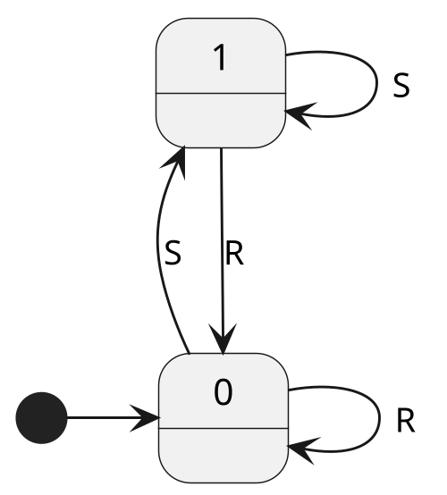
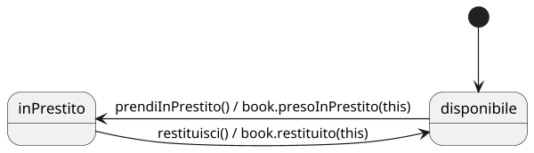
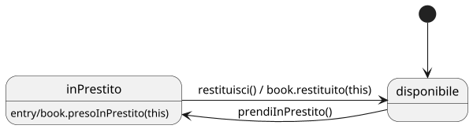
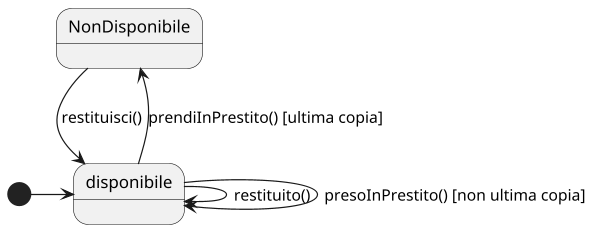

# State diagram

## Concetto e struttura

L'obiettivo del **diagramma di stato** è fornire un'astrazione di comportamento significativa che sia comune all'intera classe.

La sua struttura deriva dai classici *State Charts*, dei quali costituisce un'ulteriore astrazione.

Al fine di comprendere meglio i diagrammi di stato, può essere utile ricordare che:

> Negli _State Charts_, un automa è una sestupla \\(\langle S, \\, I, \\, U; \\; \delta, \\, t, \\, s_0 \rangle\\).
> - \\(S\\): insieme finito e non vuoto degli stati;
> - \\(I\\): insieme finito dei possibili ingressi;
> - \\(U\\): insieme finito delle possibili uscite;
> - \\(\delta\\): funzione di transizione;
> - \\(t\\): funzione di uscita;
> - \\(s_0\\): stato iniziale.

### Funzione di transizione \\( \delta \\) e Stato iniziale \\( S_0 \\)
\\(\delta: S \times I \rightarrow S\\\)
La funzione di transizione stabilisce quale è lo stato successivo, dato uno stato e un ingresso.
Inoltre questa funzione può essere parziale, ovvero potrebbe non esistere un prossimo stato data una certa coppia (quindi la funzione non è definita per tutte le coppie possibili)

Per quanto riguarda lo stato iniziale invece va stabilito a priori, inoltre vi è un unico stato attivo in ogni momento.

### Esempio flip flop automa di Moore

- **Insieme degli stati**: 0 e 1;
- **Insieme dei simboli in ingresso**: S (Set) e R (Reset), sono eventi che scatenano qualche cambiamento di stato;
- **Possibili transizioni**: rappresentate dagli archi etichettati;
- **Funzione di uscita**: in questo caso è lo stato corrente che viene comunicato esternamente, però può anche non essere cosi.

Negli automi di **Mealy** la funzione di uscita è data sia dallo stato, sia da come è stato raggiunto quello stato, quindi la definizione della funzione \\(t\\) diventa questa: \\(t: S \times I \rightarrow U\\\).

Questa informazione nel diagramma viene posizionata sugli archi.

## In UML
Questo concetto degli atuomi a stati finiti viene mappato in UML dallo _State Diagram_, arricchendone ciò che si può fare con agli automi a stati finiti e rendendoli compatibili con il dominio applicativo dei diagrammi UML, ovvero le classi.
Ogni _stato_ è rappresentato da un rettangolo, lo _stato iniziale_ è indicato da un pallino nero.

Un'osservazione importante da fare riguarda il numero di stati significativi da modellare, infatti nel caso in cui il diagramma degli stati di una classe sia troppo complesso e difficile da comprendere potrebbe significare che la classe possiede troppe responsabilità, e di conseguenza andrebbe scomposta

Gli archi in uno state diagram possono assumere diversi significati:

### Azioni (e eventi)

Corrispondono alla funzione d'uscita degli automi a stati finiti, e la distinzione tra evento e azione è:
  - **evento**: cosa provoca quella transizione, quindi quale metodo della classe viene chiamato (possono non modificare lo stato);
  - **azione**: cosa esegue quella transizione, quindi operazioni che vengono
      fatte verso l'esterno della classe, ovvero invocazioni di metodi fatte su altri oggetti.

In questo caso le azioni sono una conseguenza degli eventi, quindi alla chiamata ``restituisci()`` si verifica l'istruzione ``book.restituito(this)``

### Azioni interne allo stato
Le azioni interne dipendono esclusivamente dallo stato in cui ci si trova, indipendentemente da come ci si arriva.

### Guardie
Gli automi a stati finiti non sono deterministici, quindi dato uno stato e un evento è possibile che ci siano diversi stati seguenti.
Un esempio potrebbe essere quello di un libro che viene preso in prestito, il sistema potrebbe andare nello stato non disponibile nel caso in cui quella fosse l'ultima copia, altrimenti resterebbe nello stato disponibile.

In generale è possibile affermare che nei diagrammi UML le **Guardie** servono per disambiguare transizioni causateda da uno stesso evento e uscenti da stesso stato.

### Altri tipi di eventi
Gli altri tipi di eventi che possono presentarsi sono:
- **_time event_**: rappresentano eventi temporizzati. 
    * *After(duration)*: indicano un tempo massimo di permanenza nello stato destinazione. \
    Allo scadere del timer, lo stato cambia.
- **_change event_**: rappresentano eventi che si innescano al verificarsi di un cambiamento.
    * *When(condition)*: indicano eventi espressi in termini di valori degli attributi.

Una differenza rispetto agli automi a stati finiti è che il verificarsi di eventi non esplicitamente marcati da un arco deve portare alla terminazione dell'esecuzione e al sollevamento di un errore, questo significa che sono situazioni che **non devono accadere**, differentemente dagli automi a stati finiti, in cui la mancanza di archi indicava una situazione che **non potevano accadere**.