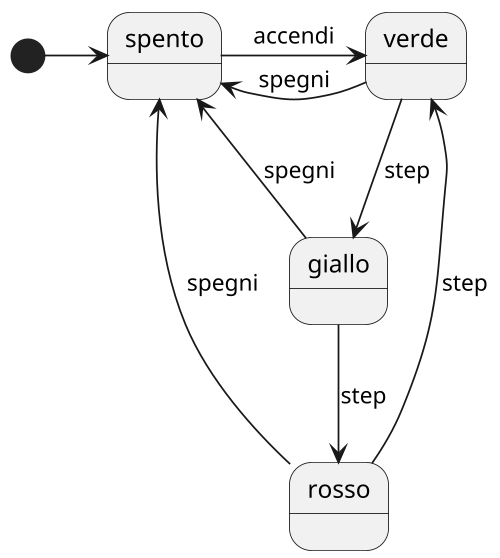
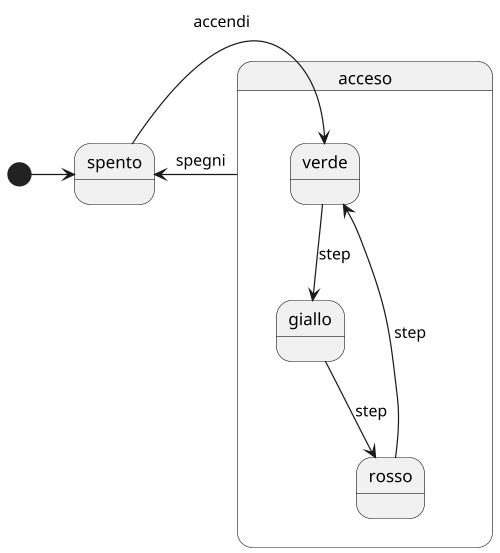
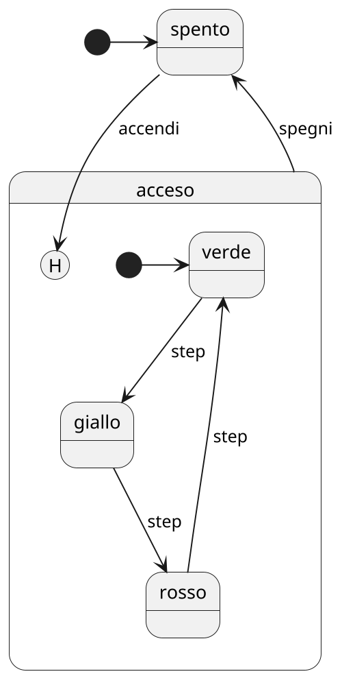
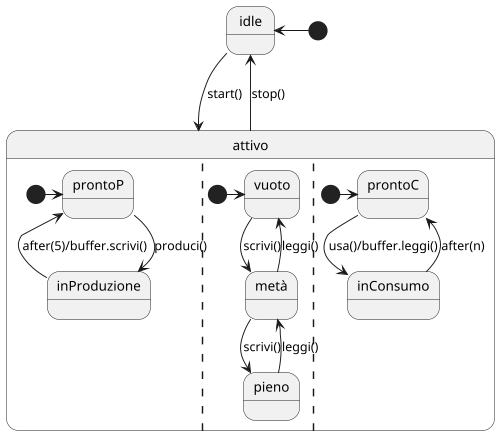

# Superstate

Ulteriore evoluzione dello State Diagram, il **Superstate** consente di rappresentare più facilmente una "gerarchia" di stati.

Partiamo da un esempio classico, il diagramma sottostante rappresenta il funzionamento di un semaforo.
Questo schema però presenta alcuni difetti, tra cui:
- **Ridondanza**: da ogni stato è possibile passare allo stato ``spegni``, e questo viene rappresentato con una freccia per ogni stato:
- **Disomogeneità**: a livello concettuale, dire che un semaforo verde quando non è spento ha poco senso, dovrebbe essere acceso, questo rende meno intuitivo e più confusionario il diagramma-

Per ovviare a questo problema è possibile descrivere uno stato tramite un altro diagramma UML degli stati, ovvero 
partendo da uno stato è possibile avere una transizione che conduce a un'altra FSM concettualmente "innestata".

Potremmo pensare però che ogni semaforo al momento dell'accensione siano verdi, questo non è corretto, sopratutto se si pensa a un incrocio.
È quindi possibile associare al diagramma uno stato **_history_**, il cui scopo è memorizzare lo stato storico prima dell'interruzione dell'FSM, in modo da riprendere il funzionamento da dove si era interrotto.

È possibile rendere il diagramma capace di rappresentare il concetto di **concorrenza** tramite la divisione in **regioni** (ognuna regolata da una propria FSM).
Le regioni possono essere attive contemporaneamente. I confini tra regioni, come mostrato nell'esempio, sono identificati da linee tratteggiate.

