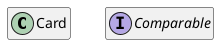
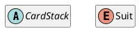
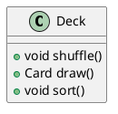
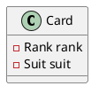

# Class diagram

## Concetto e struttura

Lo scopo del __diagramma delle classi__ è fornire una vista statica del software (una sorta di "fotografia") tramite la
rappresentazione delle sue classi, corredate di metodi, attributi e relazioni.

<!-- Hardcoded diagram because the PlantUML jekyll plugin produces a malformed version -->
<p class="plantuml-parent" align="center">
    <object class="plantuml" style="width: 70%" data="/assets/11_UML-base.svg"></object>
</p>

I componenti identificabili in un diagramma delle classi sono:

- __oggetti__ (_Classi_ e _Interfacce_), rispettivamente riconoscibili per le lettere "C" e "I" nella parte superiore di
  ogni blocco.



<p class="tab"> Esiste anche il marcatore "A", che rappresenta una classe astratta.
Inoltre, per i diagrammi UML relativi a Java si può usare la lettera "E" per rappresentare le classi enum;</p>



- __metodi__: preceduti da un cerchio e dal tipo di valore ritornato;



- __attributi__: preceduti da un quadrato, corrispondono agli attributi dell'oggetto;



- __relazioni__: frecce che connettono gli oggetti.

È possibile rappresentare il _cerchio_ dei metodi e il quadrato degli attributi con colori diversi in base alla
visibilità.
In Java, ad esempio, si può usare il <span style="color:green">verde</span> per la visibilità `public`,
l'<span style="color:orange">arancio</span> per `protected` e il <span style="color:red">rosso</span> per `private`.

Valgono anche due regole sintattiche generali:

- se una scritta è in _corsivo_ vuol dire che all'elemento corrispondente manca qualche definizione ed è dunque da
  considerarsi __astratto__;
- se una scritta è <u>sottolineata</u> vuol dire che l'elemento corrispondente (tipicamente metodo o attributo) è _
  _statico__, ovvero ha una visibilità a livello di classe e non a livello di istanza (_i.e_ è possibile riferirsi a
  esso anche senza avere precedentemente istanziato la classe);
- se è incluso tra << >> allora si tratta di uno __stereotipo__, ovvero un nuovo elemento introdotto, può essere un
  attributo o un'interfaccia ad esempio, per questo specifico _use-case_ che permette di estendere UML.

### Relazioni

Nel diagramma delle classi UML esistono relazioni di diversi tipi.
Ogni relazione viene rappresentata tramite una specifica forma di freccia:

- __frecce tratteggiate__ (___dipendenza___): sono le più generiche e indicano una relazione "gerarchica" tra classi.
  Ciò che c'è scritto nella classe da cui parte la freccia dipende dal codice che c'è nella classe a cui arriva la
  freccia (_e.g._ `Deck` dipende da `Collections`);

  La dipendenza può essere un qualcosa di negativo che alle volte si vuole evitare, questo perché può portare a diverse complicazioni, perciò vanno gestite correttamente.

  Quando si verifica un cambiamento nella classe "destinazione" (nell'immagine, Collections) è necessario cambiare anche il contenuto di Deck, ad esempio se cambia il nome di un metodo in Collections sarà necessario cambiare la chiamata di quel metodo anche in Deck.

  ```plantuml
  @startuml
  hide fields
  hide methods
  class Deck
  class Collections
  Deck .> Collections
  @enduml
  ```

- __frecce continue__ (___associazione___):
  Questo tipo di legame indica un certo legame con altre _istanze_ di una classe.
  Associazione, aggregazione e composizione rappresentano tutte lo stesso concetto ma con gradi differenti, l'associazione rappresenta il legame base tra due classi, ovvero conosce una o più istanze di una classe, ma quest'ultime non vanno a definirne la classe.

  Un esempio che rende più comprensibile il concetto è l'associazione che c'è tra professore e studenti, un professore conosce $n$ studenti ma loro non vanno a definire il professore stesso; D'altra parte però il professore può eseguire delle operazioni sugli studenti (ad esempio valutarli).  

  È importante notare come l'associazione sia bidirezionale quando non è presente la freccia alla fine della linea tratteggiata, mentre è monodirezionale quando è presente (nel caso di studenti e professore possiamo dire sia bidirezionale, perché anche gli alunni possono interagire con il professore, di conseguenza questa associazione è __navigabile__ in entrambi i sensi).

  ```plantuml
  @startuml
  hide fields
  hide methods
  class Professore
  class Studente
  Professore - Studente
  @enduml
  ```

- __frecce con rombo bianco__ (___aggregazione___): indica che all'interno della classe (_e.g._ `Deck`) è presente una
  collezione (in questo caso una lista) di \(n\) oggetti (`Card` nell'esempio). \
  Questa relazione non è più tra classi, bensì tra _istanze_ delle classi (_e.g._ un'istanza di `Deck` aggrega da 0 a 52
  carte);

  In questo caso si indica una relazione più forte rispetto ad un'associazione, infatti nell'esempio del professore, sia gli studenti che il professore rimangono tali anche se non sono associati l'uno all'altro, in questo caso invece c'è una relazione più stretta, possiamo dire che un mazzo senza carte non sarebbe utilizzabile (anche se esiste il concetto di mazzo vuoto, ma non è possibile giocare a nessun gioco con un mazzo sempre vuoto).

  Notiamo come in questo caso vale lo stesso discorso della monodirezionalità o bidirezionalità, infatti in questo caso abbiamo una freccia perché il mazzo conosce le carte ma una carta non sa in che mazzo si trova.

  Un'ultima particolarità è la cardinalità, a destra viene indicato che un mazzo può contenere da 0 a 52 carte, ma a sinistra non vi è alcuna indicazione, questo significa che un mazzo può appartenere idealmente a infiniti mazzi (nella realtà non è ovviamente possibile, ma nel nostro programma non abbiamo bisogno di $n$ istanze identiche di una carte, che tra l'altro è immutabile, ne basta una). La cardinalità è applicabile alle associazioni, alle composizioni e alle aggregazioni.

  ```plantuml
  @startuml
  hide fields
  hide methods
  class Deck
  class Card
  Deck o---r-> "0..52  " Card : \t \t
  @enduml
  ```

- __frecce con rombo nero__ (___composizione___): è utilizzata quando si hanno degli elementi che sono _fisicamente_
  collegati tra loro (non solo virtualmente come nel caso delle carte). \
  L'oggetto contenuto non può nascere prima che nasca il contenitore e non può morire dopo che muore il contenitore. Possiamo quindi dire che non possono vivere l'uno senza l'altro (a parte rari casi come nell'esempio successivo).
  Un ultima differenza è che l'oggetto contenuto non può essere acceduto direttamente, ma tramite un interfaccia fornita dal contenitore. \
  Un esempio può essere la rappresentazione del concetto di _aereo_: senza il _motore_ l'aereo non può esistere, poiché
  il primo è un oggetto indispensabile per funzionamento del secondo. Specularmente, non accadrà mai che il motore passi
  a un altro aereo (a differenza delle carte che possono passare a più mani).
  Possiamo notare però che se un motore cada dall'aereo, quest'ultimo continuerà a funzionare perché ce ne sono altri, questo però e un caso particolare.

  ```plantuml
  @startuml
  hide fields
  hide methods
  class Aereo
  class Motore
  Aereo *-> "1" Motore : \t 
  @enduml
  ```

Viene fatta la distinzione tra associazione, aggregazione e composizione, ma quasi nella totalità dei casi a livello di codice si sfrutterà un attributo per rappresentarle tutte. È importante capire la cardinalità per poter implementare al meglio la situazione.

- __frecce con la punta a triangolo__ (___implementazione___): una classe può _implementare_ una classe astratta o
  un'interfaccia.

  ```plantuml
  @startuml
  hide fields
  hide methods
  class Card
  interface Comparable
  Card .|> Comparable
  @enduml
  ```
