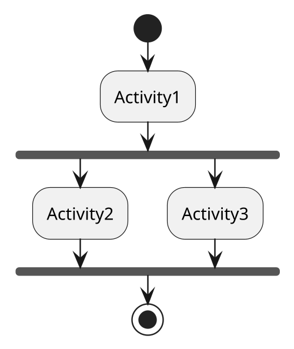
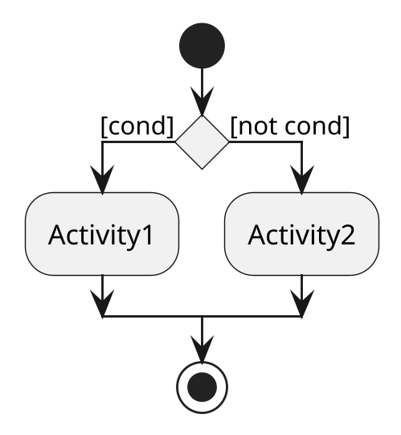

# Activity diagram

## Concetto e struttura

Gli _activity diagram_ nascono per rappresentare sistemi concorrenti, inoltre presentano una conformazione simile agli
_state diagram_, ma con svariate differenze:

* al posto degli stati vi sono le **attività**;
* non si usano più le transizioni etichettate tramite eventi &#8211; queste sono quasi tutte **implicitamente
  temporizzate** (quando un'attività termina si passa alla prossima implicitamente);
* possono esserci ***azioni* dentro le attività**;
* le *attività* possono rappresentare **elementi esterni** al sistema.

La peculiarità che distingue questo tipo di diagrammi con lo state diagram è la capacità di collegarsi con
attività esterne (ovvero non fatte dal sistema), questo fa sì che sia possibile utilizzare gli activity diagram come
**collante** con e tra diversi casi d'uso.

Inoltre la **visuale parzialmente informale**, eppure leggermente più tecnica e profonda rispetto ai diagrammi dei casi
d'uso, rende gli activity diagram un **ottimo mezzo di comunicazione interna** (*e.g.* con un manager).

## Livelli di astrazione

Si possono utilizzare i diagrammi delle attività per:

- descrivere la logica interna di un __business process__ (caso più comune);
- descrivere il __flusso interno di un metodo__, con eventuali indicazioni di (pseudo)concorrenza;
- dettagliare il __flusso di un caso d'uso__, ovvero chiarire meglio il suo flusso di esecuzione rispetto ad altri
  diagrammi (*e.g.* Sequence Diagram).
  Questa rappresentazione è assai utile nei casi in cui, ad esempio, la concorrenza è un fattore rilevante.

È chiaro quindi che questo diagramma è utilizzabile ovunque, partendo dalla descrizione di piccole parti di codice fino
ad arrivare alla descrizione generale nel sistema comprendendo le interazioni che ha con l'esterno

## Sincronizzazione

Attraverso l'uso di barre si possono stabilire dei punti di sincronizzazione (JOIN e FORK). \
I JOIN, se non diversamente specificato, vengono considerati in ___AND___, ovvero per proseguire è necessario
che terminino entrambe le attività.

È però possibile porre dei vincoli diversi per stabilire i criteri di soddisfacimento della barra di sincronizzazione
(come una __*OR*__).

É importante notare come gli Activity diagram (a differenza di altri) ha sempre un inizio e una fine, cosi come i
diagrammi di sequenza, ma introducendo la concorrenza.

## Decisioni

È possibile specificare nel flusso di esecuzione dei momenti di __decisione__.
I corsi d'azione intraprendibili in questi frangenti sono rappresentati tramite degli archi.

Le decisioni devono rispettare due proprietà:

* gli archi collegati alla decisione devono essere __mutualmente esclusivi__;
* l'__unione__ delle condizioni di decisione deve essere sempre vera.

È bene puntualizzare che i punti di decisione sono _veri_ momenti di decisione umana, questo significa che non vi è
conoscenza sulla decisione che verrà presa siccome sarà dovuta a qualcuno di esterno e non dal sistema.

Questo fa capire la differenza tra le decisioni e le guardie dello State diagram, infatti in questo caso non è possibile
che vi sia sovrapposizione tra le risposte alle decisioni (nello state diagram invece le guardie non garantivano di
coprire
tutte le situazioni che potevano verificarsi).

## Swim lane

Si può partizionare il diagramma al fine di rappresentare, sulle singole _activity_, delle particolari responsibilità
che è bene dividere dalle altre.
Queste vengono visualizzate tramite delle _"corsie"_ verticali che identificano _chi_ svolge una determinata attività.
