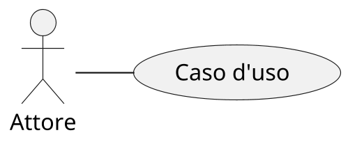
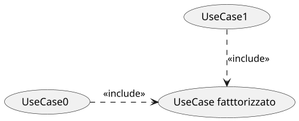
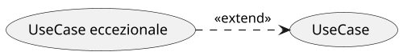
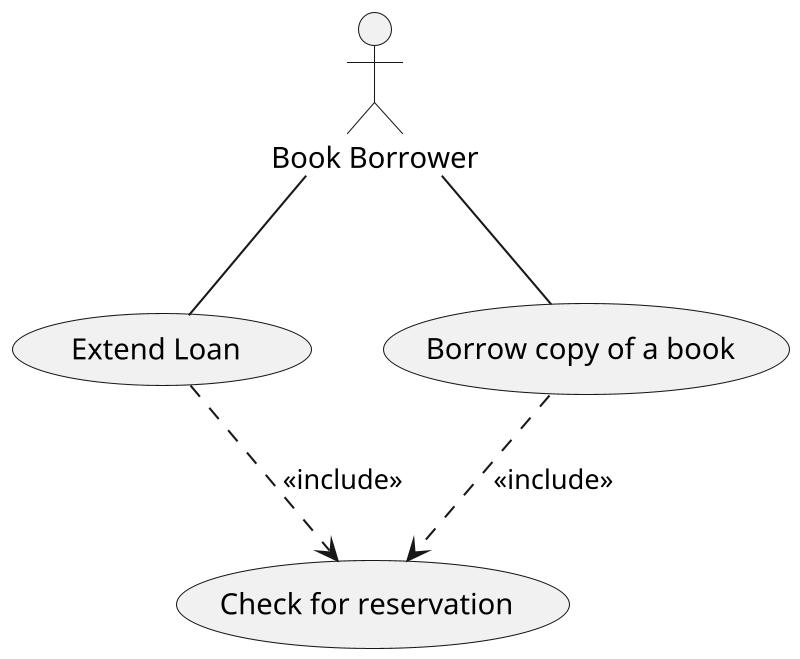
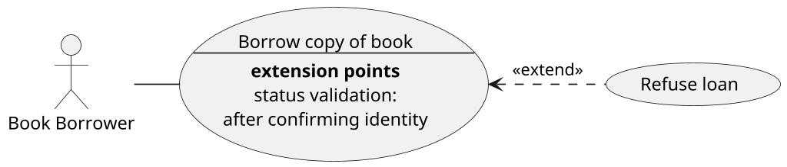

# Use cases diagram

## Concetto e struttura

I **diagrammi dei casi d'uso** rappresentano l'astrazione di un insieme di **scenari** d'uso tra loro correlati. \
Essi adottano un linguaggio che verte alla risoluzione di esigenze comunicative tramite un lessico potenzialmente meno
tecnico, che evolve durante il processo di sviluppo.
Tale natura "informale" e più semplice li rende ottimi mezzi di comunicazione col *cliente*.

Possono essere utilizzati, ad esempio, per:

* esplicitare differenti modalità di fare un compito;
* stabilire quale dovrebbe essere la normale interazione nello scenario e le eccezioni che possono verificarsi;

Infatti, ogni _scenario_ è corredato di:

* __pre e post condizioni__ da rispettare;
* __flusso di esecuzione__ da percorrere in condizioni normali;
* eventuali __eccezioni__ e loro possibili trattamenti.

L'evoluzione di questo tipo di diagramma dipende dall'evoluzione del progetto, infatti in prima battuta potrebbe
mostrare cosa avviene durante l'interazione tra utente e sistema,
e progredendo nel tempo il diagramma diventerà più dettagliato andando a rappresentare gli incarichi dei diversi
componenti e comunicano tra loro per compiere le operazioni richieste.

Infine, parte della versatilità degli *Use Case diagrams* risiede nella loro capacità di collegarsi, eventualmente, ad
altri tipi di diagrammi (*Sequence, Activity, etc*) che possono essere impiegati per descriverne in modo più
approfondito il flusso.

## Scenari

I componenti di ogni scenario si dividono in **Attori** e **Casi d'Uso**, e utili sopratutto nella raccolta dei
requisiti.

In generale il *collegamento* tra un attore e un caso d'uso rappresenta una __relazione di partecipazione__, ad esempio
"Questo attore partecipa a questo caso d'uso".

L'interazione può comunque essere denominata.

Sono contemplati anche collegamenti fra un caso d'uso e un altro (vedi [paragrafo dedicato](#assoc-ucuc)).

## Identificazione degli attori

Gli _attori_ sono delle entità **esterne al sistema** ma con cui **interagiscono** fungendo da *fonte* o
*destinatario* di informazioni, inoltre quando si parla di attori non ci si riferisce a persone fisiche, ma a **ruoli**
da essi compiuti, un altro sistema o anche una periferica hardware.
È importante notare quindi che una persona può ricoprire diversi ruoli contemporaneamente e quindi rappresentare più
di un attore alla volta.

Ci sono due attori particolari:

* **attore beneficiario**: colui che trae beneficio dall'interazione con lo use case, ovvero chi è **interessato** a
  tale funzionalità. \
  Gli altri attori possono cambiare, ma il beneficiario rimarrà probabilmente lo stesso;
* **attore primario**: colui che avvia l'interazione con lo use case.

## Identificazione use case

Il miglior modo di identificare i casi d'uso è interrogarsi su due fronti:

* **sistema**: _"quali funzionalità si desidera che il sistema possieda?"_;
* **attori beneficiari**: _"cosa vogliono?"_, _"come agiscono?"_, _"perché si interfacciano col sistema?"_ e _"cosa si
  aspettano?"_.

## Associazioni (o relazioni)

Successivamente è fondamentale creare le relazioni tra le figure individuate facendo molta attenzione, poiché da
essere dipenderà la compressione e lo sviluppo del progetto. I diagrammi UML possono essere usati per basare la
struttura del codice di sviluppo o addirittura creare il software in maniera automatica partendo da essi.

Ogni diagramma dei casi d'uso deve seguire due convenzioni per quanto riguarda le associazioni.

> Ogni attore deve avere almeno un'interazione con un caso d'uso.

Un attore che non dovesse possedere alcuna associazione con un caso d'uso sarebbe impossibilitato a interagire col
sistema e rappresentarlo nel diagramma non avrebbe alcun senso.

> Ogni caso d'uso deve essere associato ad almeno un attore.

Un caso d'uso che non coinvolge alcun attore è un caso d'uso che, per definizione, non ha senso di esistere, poiché
nessuno è in grado di interagirvi.

### Relazioni _use case - use case_

Esistono due tipologie di relazioni tra use case:

**Inclusione (*include*)**: relazione che esprime il predicato *"far parte di"*, chi include conosce sempre gli inclusi,
ma non viceversa (La parte inclusa *deve* essere eseguita).
Viene utilizzata per fattorizzare una serie di spiegazioni di comportamento comuni a diversi use cases.

**Estensione (*extend*)**: relazione che viene utilizzata per rappresentare casi eccezionali che specificano
comportamenti particolari in alcuni use case.

### Generalizzazione

L'associazione di **generalizzazione** rappresenta un particolare tipo di relazione, applicabile sia a una coppia
*attore - attore* che a una coppia *use case - use case*.

La sua semantica dipende dal contesto a cui viene applicata:

* **tra attori**: permette di esplicitare eventuali relazioni tra ruoli. \
  Ad esempio un ruolo potrebbe includerne un altro.
* **tra use case**: la semantica è simile all'*extend*, ma senza punti d'estensione. Infatti, alcune parti della
  descrizione vengono *ereditate* e altre vengono *sostituite*. Non si applica il secondo principio della Liskov (questa
  generalizzazione è deprecata da UML 2.0).

## Esempi di utilizzo

Nel seguente diagramma,

l'attore _Book Borrower_ è associato alle seguenti operazioni:

- prendere in prestito un libro;
- chiedere l'estensione del prestito di un libro.

In entrambi i casi, il bibliotecario deve controllare l'esistenza di una richiesta di prenotazione per il libro.

Il prossimo diagramma è differente:

_rifiuta il prestito_ può essere l'__estensione__ di un comportamento normale come _prendi in prestito il libro_.
In quest'ultimo ci sono dei punti di estensione in cui vengono fatti dei controlli, come la verifica dello stato di
prestito del libro o dell'identità del richiedente.
