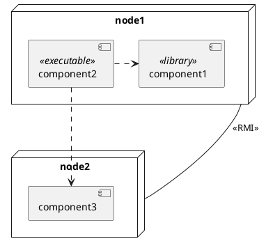

# Deployment diagram

Il _Deployment diagram_ permette di rappresentare la __dislocazione fisica__ delle risorse. \
Più precisamente, specifica la dislocazione fisica delle _istanze dei componenti_.

Il _Deployment diagram_ è una vista statica della configurazione a run-time, ovvero viene rappresentato come i diversi
componenti utilizzati sono posizionati sulle macchine e come comunicano tra loro

La conformazione del diagramma è quindi molto simile a quella del diagramma dei componenti, ma con qualche differenza:
* i __nodi__ del sistema indicano macchine fisiche;
* i __collegamenti__ tra nodi eplicitano le modalità di comunicazione tra gli stessi (_e.g._ RMI, HTTP).

Il Deployment diagram risulta di particolare utilità per il _deployer_, _i.e._ la figura che si occupa dell'installazione fisica del sistema. Così si potranno evitare ripetizioni inutili delle stesse risorse ma ottimizzare il loro utilizzo trasversale tra le varie componenti del sistema.
