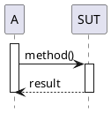
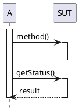
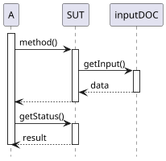

```plantuml
@startuml
scale 150 height
scale 150 width

hide footbox

participant A
activate A

A -> SUT: method()
activate SUT

SUT -> outputDOC: doOutput()
activate outputDOC

outputDOC --> SUT
deactivate outputDOC

SUT --> A
deactivate SUT

A -> outputDOC: getStatus()
activate outputDOC

outputDOC --> A: result
deactivate outputDOC
deactivate A

@enduml
```

# Test Double

Può risultare assai difficile testare un SUT che dipende da componenti software non utilizzabili per un motivo o per l'altro.
Questi componenti prendono il nome di **depended-on component** (DOC) e i problemi che questi possono far emergere durante la stesura di un test sono molteplici.
Ad esempio, i DOC potrebbero non essere disponibili in quel momento, non restituire i risultati che servono a un determinato test (o restituirli solo tramite artifici troppo complessi) oppure perché la loro esecuzione avrebbe effetti collaterali indesiderati.
In altri casi ancora, la strategia di testing adottata richiede un maggiore controllo o più visibilità sul comportamento interno del SUT e l'utilizzo di un DOC reale rende l'operazione complessa. \
Un altro esempio comune è la necessità di testare che all'avvenire di un evento _randomico_ accada qualcosa in particolare ci porterebbe a rieseguire lo stesso test fino a che quell'evento non avvenga, che in base ai casi potrebbe avverine dopo molto tempo, quindi potremmo voler forzare che questo evento accada per poterlo testare.

Quando si scrive un test in cui non si può (o si sceglie di non) usare il vero componente da cui si è dipendenti, si può sostituire quest'ultimo con un Test Double, durante la fase di set up.

**Test Double** è un termine generico utilizzato per indicare un qualunque oggetto con cui si sostituisce un DOC reale a scopo di test.  
Ovviamente, a seconda del tipo di test che si sta eseguendo, si può codificare diversamente il comportamento del Test Double.
Non è necessario che questo si comporti come il DOC reale: il suo scopo è solo quello di fornire le stesse API in modo che la sua presenza risulti essere trasparente al SUT. 
In altre parole, per il SUT interagire con il DOC reale o con il Test Double deve essere esattamente la stessa cosa.
L'utilizzo di Test Double rende possibile la scrittura di test che precedentemente risultavano troppo articolati, complicati o dispersivi da realizzare.

Il **mocking** è la tecnica di testing che ci permette di sostituire i DOC reali con i vari Test Double.
Effettuare mocking permette di ottenere test più efficienti, affidabili e puliti, consentendo agli sviluppatori di isolare il SUT in un ambiente più controllato.

Come si può osservare dall'immagine sottostante, vi sono diversi tipi di Test Double:  

- [**Dummy objects**](./01_dummy-objects.md)
- [**Stub objects**](./02_stub-objects.md)
- [**Mock objects**](./03_mock-objects.md)
- [**Spy objects**](./04_spy-objects.md)
- [**Fake objects**](./05_fake-objects.md)
- [**Mocked construction**](./06_mocked-construction.md)
- [**Riepilogo**](./07_riepilogo.md)
